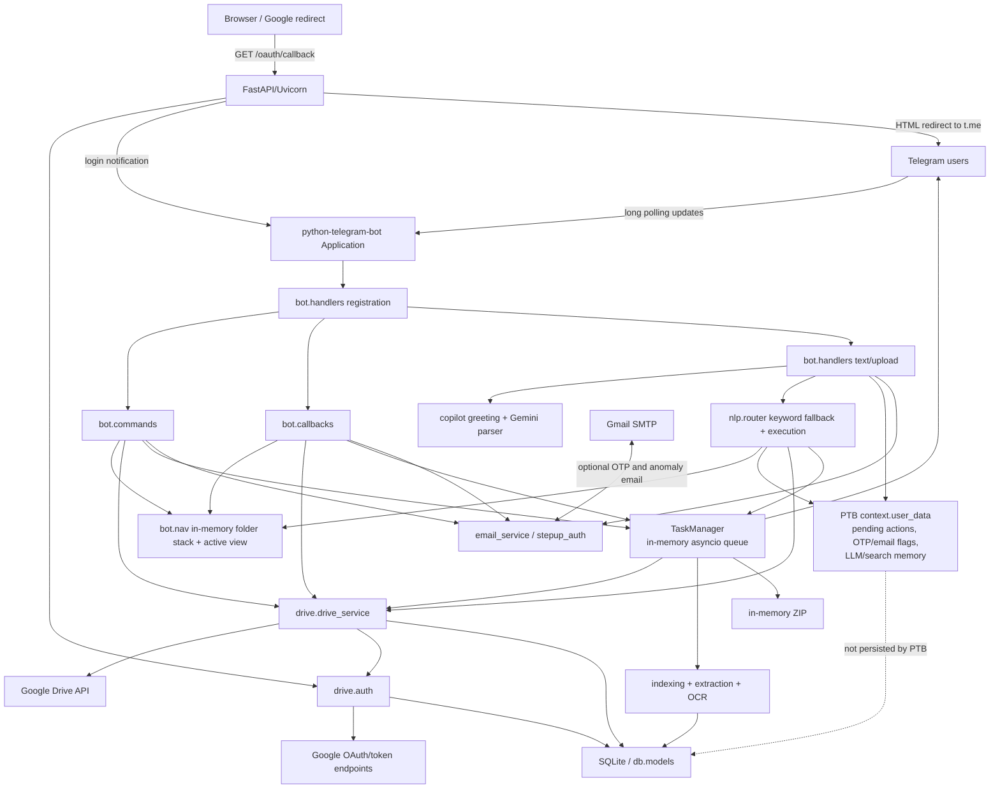

# NotesBuddy Current Architecture Audit

**Audit date:** 2026-07-26  
**Scope:** The tracked repository plus the presence (not the secret values) of ignored local runtime artifacts.  
**Constraint observed:** No application code, dependency, configuration, or existing documentation was modified.

## Evidence labels

- **Confirmed** means the behavior is directly implemented or configured in the repository.
- **Observed locally** means it is true of this checkout's ignored runtime artifacts; it is not necessarily true in production.
- **Inference** means the conclusion follows from the code but needs a running Telegram, Google, SMTP, OCR, or deployment environment to prove end to end.
- **Not wired** means implementation exists but no active runtime call path was found.
- **Not evidenced** means the repository does not prove the advertised or expected capability.

## Executive summary

NotesBuddy is a single-process Python application. `main.py` initializes SQLite, starts a `python-telegram-bot` application using long polling, starts an in-process asynchronous job queue, and then runs Uvicorn/FastAPI for the Google OAuth callback and health endpoint. Telegram handlers call Google Drive wrappers, SQLite helpers, navigation/session helpers, NLP/LLM routing, and Telegram formatters directly.

The core Drive API wrapper is mostly independent of Telegram, but the surrounding business workflow is not. Commands, callbacks, ordinary-message handling, confirmations, step-up verification, navigation state, and response rendering are spread across `bot/commands.py`, `bot/callbacks.py`, `bot/handlers.py`, and the very large `nlp/router.py`. `db/models.py` similarly owns schema creation and persistence for unrelated domains.

The most important confirmed findings are:

1. **Selection and dialogue behavior is fragmented.** A dedicated `copilot/dialogue.py` selection/default-action module exists, but it is not called. A plain numeric message such as `1` therefore has no deterministic non-LLM path. The active index is a single replaceable in-memory view per Telegram user.
2. **The README overstates persistence and indexing.** Folder paths and active selections are memory-only, not persistent. Displayed indices are flat (`1`, `2`, …), not hierarchical. `/search` and natural-language search query only the user's local SQLite FTS5 index, which is populated incrementally and explicitly; they do not perform a live full-Drive search.
3. **Search has two competing contexts.** `bot.nav` holds the active displayed index while `nlp.context` separately holds LLM search results. Some paths update only one. A later browse/recent/suggestion view can replace numeric selection while the LLM still receives an older search context.
4. **OAuth CSRF and PKCE are implemented, but refresh persistence is incomplete.** Access and refresh tokens are stored, optionally encrypted, but token expiry is not stored. Reconstructed Google credentials therefore cannot reliably know when to refresh proactively.
5. **Step-up verification does not resume the interrupted operation.** After a successful OTP, users generally have to repeat the original action. In the pending natural-language confirmation path, the pending action is removed even when execution stops to request OTP.
6. **The optional allowlist is not a global authorization gate.** It is checked only by `/start`; other commands and the implemented callback-login path do not apply it. The current UI does not emit that callback-login button, but existing authenticated users are not rechecked.
7. **The background queue protects the event loop from most Drive downloads, ZIP work, indexing, extraction, and OCR, but it is memory-only.** Job rows are persisted for status only and are not recovered after restart. ZIP construction is entirely in memory, and its intended aggregate-byte guard is ineffective because the live ZIP search does not request file sizes.
8. **LLM output is JSON-parsed but not validated against a strict schema.** The LLM does not call Drive directly, but its parsed intent is immediately dispatched to backend handlers. Some operations execute without confirmation, and Drive filenames are included in model context without an explicit untrusted-data boundary.
9. **Email transport is implemented, but email ownership is not verified.** Any syntactically valid address is immediately stored with `verified=1`. SMTP delivery depends on optional Gmail environment variables. Anomaly email alerts are connected, but only download and callback-delete paths invoke anomaly checks; configured move and rename thresholds are unused.
10. **The test suite is small and unit-oriented.** All 47 discovered tests passed in the repository virtual environment, but the critical multi-turn, OAuth, persistence, Drive, selection, destructive-confirmation, and LLM-safety paths are not covered.

No single issue requires a rewrite. The safest direction is to stabilize one authoritative per-user dialogue/selection model with tests, then extract transport-neutral use cases incrementally.

## Current architecture

### Architectural boundaries

| Layer | Current implementation | Boundary quality |
|---|---|---|
| Telegram transport | `bot/handlers.py`, `bot/commands.py`, `bot/callbacks.py`, `bot/ui.py`, `bot/formatter.py` | Telegram-specific concerns are identifiable, but handlers also own orchestration and business decisions. |
| Dialogue/NLP | `nlp/*`, `copilot/*`, parts of `bot/handlers.py` | Multiple overlapping context and dialogue abstractions exist; some are unused. |
| Drive integration | `drive/auth.py`, `drive/drive_service.py` | Drive API calls have async wrappers and no Telegram imports. Persistence/audit calls remain embedded in the service. |
| Persistence | `db/models.py` | One module owns schema/migrations and CRUD for every domain. |
| Background work | `tasks/manager.py` | In-process queue only; execution and Telegram notification are coupled. |
| Security/operations | `security/*`, `services/stepup_auth.py`, `services/anomaly_detection.py`, `monitoring/*`, `storage/sandbox.py` | Useful controls exist, but enforcement is inconsistent across entry paths. |

## 1. Repository overview

### Important top-level files

| Path | Responsibility |
|---|---|
| `main.py` | Loads `.env`; configures logging; defines FastAPI middleware/routes; performs OAuth callback orchestration; builds, starts, and stops Telegram polling, task workers, cleanup, and Uvicorn. |
| `README.md` | Feature, command, architecture, setup, and security claims. Several claims differ from current code, documented below. |
| `.env.example` | Documents Telegram, Google, server, DB, encryption, temp, step-up, limits, OCR, allowlist, SMTP, and Gemini settings. |
| `requirements.txt` / `requirements.lock` | Runtime dependency declarations and lock data. |
| `requirements-dev.txt` | Security tooling (`pip-audit`, `safety`, `bandit`, `pip-tools`). |
| `Procfile`, `railway.json` | Start `python main.py`; Railway uses Nixpacks and on-failure restart. |
| `start_with_ngrok.ps1` | Starts an ngrok tunnel, rewrites `.env`'s OAuth redirect URI, then launches the virtual-environment Python. |
| `.github/workflows/security.yml` | Installs dependencies, runs unittest, two dependency audits, Bandit, and Gitleaks. |
| `templates/success.html` | Browser page used after OAuth, with Telegram web/app URLs substituted by `main.py`. |

### Packages and modules

| Package/module | Confirmed responsibility |
|---|---|
| `bot/handlers.py` | Registers handlers; handles Telegram media uploads; owns ordinary-text precedence; invokes Gemini and fallback NLP. |
| `bot/commands.py` | Implements all registered slash commands, authentication/rate checks, Drive orchestration, confirmations, and some step-up flow. |
| `bot/callbacks.py` | Single dispatcher for every inline callback namespace; duplicates browse, download, upload, auth, clear, and step-up orchestration. |
| `bot/nav.py` | Process-local LRU map keyed by Telegram user ID; stores folder stack and one active indexed view. |
| `bot/ui.py` | Inline keyboard construction and callback payloads. |
| `bot/formatter.py` | Telegram-facing message templates and Drive metadata/list rendering. |
| `bot/errors.py` | Global Telegram exception reporting. |
| `drive/auth.py` | OAuth client resolution, authorization URL, CSRF state, PKCE, code exchange, token refresh attempt, and revocation. |
| `drive/drive_service.py` | Synchronous Drive v3 operations plus `asyncio.to_thread` wrappers; Shared Drive listing; audit/file logging. |
| `nlp/intents.py` | `IntentType` enum and `Intent` data structure. |
| `nlp/normalize.py` | Abbreviation/typo normalization, fuzzy action matching, and numeric extraction. |
| `nlp/context.py` | A second per-user search context, legacy result context, last-state TTL, and in-memory conversation history, all stored in PTB `user_data`. |
| `nlp/router.py` | Keyword intent detection, reference resolution, every intent's orchestration, bulk actions, confirmations, step-up, search, and browsing. |
| `copilot/llm.py` | Gemini configuration, global throttle, JSON intent extraction, and loose output parsing. |
| `copilot/slot_filler.py` | Required-slot definitions and in-memory pending-slot state. |
| `copilot/greeting.py` | Regex/phrase greeting detection and canned replies. |
| `copilot/dialogue.py` | Selection, confirmation, default-action, and disambiguation helpers. **Not wired.** |
| `copilot/conversation.py` | Alternative `ConversationMemory` abstraction in `user_data`. **Not wired.** |
| `copilot/response_gen.py` | Additional response helpers. Most active responses use `bot.formatter`; only imports do not establish a substantive separate response layer. |
| `copilot/user_profile.py` | Behavior logging and ranking helpers. Search logging is called from the Gemini path; ranked search is not used by active search handlers. |
| `indexing/indexer.py` | Metadata upsert, Drive download for indexing, hashing, extraction, keyword generation, and FTS upsert. |
| `indexing/extractors.py` | PDF, DOCX, PPTX, text, image OCR extraction and MIME detection fallback. |
| `indexing/normalize.py` | Index/search tokenization, stop words, abbreviations, and keyword frequency. |
| `indexing/search.py` | Per-user FTS5 query, optional behavior re-ranking helper, and fuzzy metadata suggestions. |
| `db/models.py` | SQLite configuration, complete schema/migrations, token crypto, and CRUD for users, OAuth, audit, email, OTP, jobs, index, anomaly, behavior, and conversations. |
| `tasks/manager.py` | In-memory worker queue, persisted status updates, Telegram progress messages, and download/ZIP/index execution. |
| `services/stepup_auth.py` | Optional email OTP generation, hashing, cooldown, verification window, and SMTP call. |
| `services/email_service.py` | Gmail SMTP transport and security-alert email bodies. |
| `services/anomaly_detection.py` | Per-user action thresholds, security-log record, all-user token revocation attempt, and email alert invocation. |
| `services/zip_service.py` | In-memory ZIP generation with sanitized/deduplicated entry names. |
| `services/parser.py` | Command argument and human-size helpers. |
| `security/validators.py` | Text, filename, query, index, Drive ID, email, and ZIP-name validation. |
| `security/uploads.py` | Upload size, extension, MIME detection, and declared/detected compatibility checks. |
| `security/rate_limit.py` | Process-local per-user/action cooldown and sliding-window limiter. |
| `security/limits.py` | Environment-driven operational limits and Copilot settings. |
| `storage/sandbox.py` | Per-user temporary directories, safe path construction, file removal, and TTL cleanup. |
| `monitoring/*` | JSON logging, redaction, context variables, and timing. |
| `tests/*` | Unit tests for a small navigation case, keyword NLP, rate limiting, sanitization, validation, and upload rejection. |

### Files with multiple or overlapping responsibilities

- **Confirmed:** `main.py` combines web middleware/routes, OAuth callback presentation, Telegram lifecycle, task-worker lifecycle, cleanup scheduling, and deployment logging.
- **Confirmed:** `bot/handlers.py` combines handler registration, upload ingestion, authentication/step-up orchestration, email/OTP input, dialogue precedence, Gemini calls, and intent dispatch.
- **Confirmed:** `bot/commands.py` and `bot/callbacks.py` each contain transport handling plus business workflow and security decisions, with duplicated browse/download/upload/logout/step-up logic.
- **Confirmed:** `nlp/router.py` is the largest concentration: parsing, fuzzy matching, selection, Drive operations, persistence, confirmation state, bulk execution, security, queueing, and Telegram replies.
- **Confirmed:** `db/models.py` combines migrations and data access for at least 14 logical tables across authentication, files, preferences, security, tasks, search, behavior, and conversations.
- **Confirmed:** `services/anomaly_detection.py` combines detection policy, incident response, cross-user revocation, persistence, and notification.
- **Confirmed overlap:** `bot.nav`, `nlp.context`, `copilot.conversation`, `copilot.dialogue`, database `conversation_turns`, and PTB `user_data` represent multiple partially overlapping attempts at session/dialogue state.

## 2. Application startup

### `main.py` sequence

1. **Confirmed:** Module import calls `load_dotenv()` before application modules read environment variables.
2. **Confirmed:** Logging is configured and the FastAPI app, middleware, `/oauth/callback`, and `/health` routes are created at import time. `templates/success.html` is read at import time.
3. **Confirmed:** `asyncio.run(main())` logs environment information and calls `init_db()` plus `cleanup_expired_states()`.
4. **Confirmed:** `build_bot()` requires `TELEGRAM_BOT_TOKEN`, configures PTB's `AIORateLimiter`, and registers all Telegram handlers.
5. **Confirmed:** A `TaskManager` is placed in application-wide `bot_data`, then PTB is initialized and started.
6. **Confirmed:** `updater.start_polling(drop_pending_updates=True)` starts **long polling**, not Telegram webhooks. Updates waiting before startup are discarded.
7. **Confirmed:** The bot username is saved in a process global for OAuth browser redirects.
8. **Confirmed:** Task workers start, and an unreferenced `asyncio.create_task` begins the 30-minute cleanup loop.
9. **Confirmed:** Uvicorn is run in the same event loop via `await server.serve()`, binding to `HOST`/`PORT`.
10. **Confirmed:** When `server.serve()` returns normally, polling and task workers stop, followed by PTB stop/shutdown.

### FastAPI and Telegram coexistence

They are two asynchronous subsystems in the same OS process and event loop. PTB polling is started first and continues in background tasks while the main coroutine awaits Uvicorn. FastAPI is not used as a Telegram webhook endpoint; its only application endpoints are OAuth callback and health.

### Startup/background/shutdown risks

- **Confirmed:** The periodic task cleans expired OAuth states and old audit records (through one DB helper), completed/failed task rows, anomaly counters, temp sandboxes, and navigation sessions.
- **Confirmed:** `cleanup_old_behavior()` and `cleanup_old_turns()` exist but are not called by startup or periodic cleanup.
- **Confirmed:** The periodic cleanup task handle is not retained or explicitly cancelled/awaited.
- **Confirmed:** There is no outer `try/finally` around bot startup and `server.serve()`. An exception after PTB starts but before normal Uvicorn return can bypass the graceful shutdown block.
- **Confirmed:** Shutdown waits for workers after inserting sentinels behind already queued jobs. Long Drive/Telegram operations can therefore prolong shutdown.
- **Inference:** A platform termination deadline may kill the process before workers finish, losing queued work and leaving `running`/`queued` DB records.

## 3. Telegram message flow

### Command registration to execution

- `main.build_bot()` calls `bot.handlers.register_handlers()`.
- All `CommandHandler`s are registered before callback and message handlers in PTB's default handler group.
- A command such as `/download 2` is matched by `CommandHandler("download", cmd_download)`.
- `cmd_download` checks the database token, parses and validates the index, resolves it against `bot.nav`'s single active view, rejects folders, requests optional step-up, checks download anomaly rate, reads live metadata, and enqueues a background download.
- Ordinary command implementations directly format and send Telegram replies; there is no transport-neutral command/use-case layer.

### Ordinary text precedence

`MessageHandler(filters.TEXT & ~filters.COMMAND, handle_text_input)` applies this confirmed order:

1. Pending email entry (`awaiting_email`).
2. Pending six-digit OTP entry (`awaiting_otp`).
3. Pending Gemini slot fill (`_pending_slots`).
4. Pending keyword-router action/confirmation (`pending_action`), including missing name/destination.
5. Passive capture of a syntactically valid email for an authenticated user without an email.
6. Fast greeting detection.
7. Gemini availability, global throttle, intent extraction, chitchat/off-topic reply, slot check, and `nlp.router.execute_intent`.
8. Keyword `nlp.router.handle_nlp_message` fallback.
9. A final login-required reply only if neither route handled the text and the user is unauthenticated.

**Confirmed:** There is no active “selection resolver before pending task” stage, despite the architecture described in `copilot/dialogue.py`. Pending actions take precedence over a plain selection.

### Plain numeric messages

- **Confirmed:** Slash commands explicitly resolve numeric indices through `nav.resolve_index`.
- **Confirmed:** NLP action phrases such as “download 2” resolve through `nav.resolve_smart`.
- **Confirmed:** `copilot.dialogue.resolve_selection()` and `get_default_action()` implement the intended folder-open/file-download behavior but have no call sites.
- **Confirmed:** With Gemini unavailable, a plain `1` becomes keyword intent `UNKNOWN` and receives the ambiguous-action response.
- **Inference:** With Gemini enabled, the result depends on the model's classification; the system prompt explains ordinal mapping but does not define the plain-selection default. It is therefore not deterministic.

### Inline callback flow

`CallbackQueryHandler(handle_callback)` receives every callback:

1. Answers the query.
2. Rejects empty, over-128-character, or non-printable callback data.
3. Splits `namespace:action[:argument]`.
4. Dispatches `nav`, `stepup`, `file`, `confirm`, or `upload`.
5. Validates Drive IDs for file/confirm namespaces and checks authentication before Drive operations.
6. Uses new Telegram messages for most results; `_edit` exists but is not used in the main dispatcher.

Callback payloads can browse/back/home/refresh/menu/search/upload/login/logout/tools/recent/mkdir/clear; show/download/favorite/delete files; confirm delete; resend OTP; and confirm/cancel a pending upload.

## 4. OAuth flow

### Authorization

1. **Confirmed:** `/start` checks `ALLOWED_USERS` and either shows the authenticated menu or calls `drive.auth.get_auth_url(uid)`.
2. **Confirmed:** There is no registered `/login` command. Natural-language “connect my drive” delegates to `/start`, and `nav:login` calls `get_auth_url` directly.
3. **Confirmed:** `get_auth_url` creates a random nonce and PKCE verifier/challenge, deletes older states for that user, and stores `(telegram_id, nonce, code_verifier, created_at)` in SQLite.
4. **Confirmed:** Google authorization requests the broad `https://www.googleapis.com/auth/drive` scope, offline access, forced consent, state `telegram_id:nonce`, and S256 PKCE.

### Callback and token storage

1. Google redirects to `GET /oauth/callback`.
2. `main.py` validates presence and a restricted state format/length.
3. `exchange_code` parses the Telegram ID and calls `verify_oauth_state`.
4. SQLite requires the nonce to be younger than 10 minutes and consumes it on successful lookup.
5. The Google authorization code is exchanged with the stored verifier.
6. Access and refresh tokens are upserted into `users`; encryption is applied in `db.models` when configured.
7. The running Telegram bot sends login success and, if absent, an email setup prompt.
8. The browser receives the template page with a validated bot username and Telegram app/web links.

### Encryption, refresh, and revocation

- **Confirmed:** `TOKEN_ENCRYPTION_KEY` is SHA-256-derived into a Fernet key. Tokens are encrypted/decrypted at the DB boundary.
- **Confirmed:** Production is detected only by the presence of `RAILWAY_PUBLIC_DOMAIN`; `init_db()` aborts there if encryption is not enabled. Other production hosts are not covered by that enforcement.
- **Confirmed:** Without the key, tokens are plaintext. **Observed locally:** this checkout's `.env` does not declare `TOKEN_ENCRYPTION_KEY`.
- **Confirmed:** Decryption failure returns the stored value unchanged, supporting pre-encryption plaintext but also masking a wrong/rotated key as if ciphertext were a usable token.
- **Confirmed:** Only token and refresh token are persisted. Expiry is not persisted or supplied when reconstructing `Credentials`.
- **Risk:** The `if creds.expired and creds.refresh_token` branch cannot reliably perform proactive refresh after reconstruction because expiry is unknown. An expired access token may instead produce an API 401 and force reauthentication.
- **Confirmed:** `/logout` and logout callback synchronously call Google's revoke endpoint, then delete the local user row and favorites regardless of remote revocation success.
- **Confirmed:** Local logout does not remove user email, OTP, audit, index/FTS, behavior, conversation, alert, anomaly, or task data.

### Configuration and production assumptions

- Credentials are resolved from `GOOGLE_CLIENT_ID` plus `GOOGLE_CLIENT_SECRET`, otherwise `GOOGLE_CREDENTIALS_FILE` (default `credentials.json`).
- The default redirect is `http://localhost:8000/oauth/callback`; Railway documentation expects an exact public HTTPS URL.
- `HOST` defaults to `0.0.0.0`; `PORT` defaults to `8000`.
- **Observed locally:** `.env`, `credentials.json`, and `bot_data.db` exist and are ignored. Only key names/file shape were inspected; secret values were not included in this audit.
- **Confirmed:** HTTPS is documented but not programmatically enforced. HSTS is emitted even for local HTTP responses.

## 5. Google Drive operations

| Operation | Implementation and active entry paths | Status |
|---|---|---|
| Folder listing | `drive_service.list_directory`; `/info`, browse callback, NLP browse/open, indexing pre-list | Implemented; lazy, paginated, capped at 2,000 items per folder. |
| Folder opening | Navigation resolves displayed item IDs; `open_folder()` also exists but no active call site was found | Implemented through active-view IDs; exact-name service helper is unused. |
| Going back | `nav.pop_folder`; `/cd` or `/back`, callback, NLP back | Implemented. Command/callback refresh listing; NLP back only reports the path. |
| Search | `drive_service.search_files` live name search; `indexing.search.search_index` local FTS | Both exist, but user `/search`/NLP use FTS only. Live search is used by ZIP generation. |
| Upload | `upload_file` and async wrapper; Telegram media handler/callback | Implemented. Any authenticated supported media message is handled, even if `/upload` mode was not set. |
| Download | `download_file`; command/callback/NLP queue | Implemented with Google Workspace export and per-file byte cap. |
| Metadata | `get_file_metadata`; `/more`, callback, NLP info and safety checks | Implemented. |
| Create folder | `create_folder`; `/mkdir`, NLP | Implemented immediately, without confirmation. |
| Rename | `rename_file`; command/NLP pending confirmation | Implemented and audit logged. |
| Delete | `delete_file`; command/callback/NLP confirmation | Implemented as permanent Drive deletion, not move-to-trash; audit logged. |
| Move | `move_file`; command/NLP pending confirmation | Implemented and audit logged. Removes all previous parents. |
| Copy | `copy_file`; NLP only | Implemented; single copy normally executes without confirmation; audit logged. |
| ZIP | `TaskManager._build_zip_payload` plus `zip_service.create_zip`; command/NLP | Implemented as live name search, sequential downloads, and in-memory archive. |
| Sharing | `create_share_link`; NLP only | Implemented as “anyone with link” reader permission after capability check, textual confirmation, and optional step-up; audit logged. |

### Drive/Telegram separation

- **Confirmed:** `drive/drive_service.py` imports no Telegram classes and exposes data/bytes.
- **Confirmed:** It is not a pure infrastructure adapter because it also writes `files` and `audit_log`.
- **Confirmed:** Telegram and business logic are heavily mixed above it: handlers decide authentication, limits, target resolution, confirmation, security checks, queueing, and user messages.
- **Confirmed:** Sync Google client calls and retry sleeps are wrapped by `asyncio.to_thread` in active asynchronous paths. Direct synchronous auth revocation remains in async handlers.

## 6. Navigation and indexing

### Current folder

`bot.nav._sessions` is an `OrderedDict[int, _UserSession]`. Each user starts with `[("root", "Home")]`; folder IDs/names are pushed/popped in a stack. It has a 24-hour inactivity TTL, an LRU cap of 5,000 users, and stack depth cap 50.

**Confirmed:** This is process memory only. Restart, multi-process routing, or eviction resets the user to root.

### Display indices

Every displayed view has one `dict[str, IndexedItem]`:

- Folder entries are numbered first, then files continue the same flat sequence.
- Search, recent, favorite, and suggestion results are separately numbered from 1.
- Setting any new view replaces the previous mapping.
- `IndexedItem` stores Drive ID, name, MIME, folder/shortcut flags, display index, and a display path.

Despite validators and README references to `1.2.3`, current builders produce only flat simple indices, and `resolve_index` does exact key lookup. Command paths are inconsistent: `/cd`, `/download`, and `/more` require simple integers, while rename/move/delete validation accepts dotted forms that current maps do not generate.

### Search-result indices

- Command `/search` sets only `bot.nav.active_view`.
- NLP search sets both `bot.nav.active_view` and `context.user_data["_search_context"]`.
- `_search_context` stores up to 25 result dictionaries, query, timestamp, view type, scope label, and original result count for 15 minutes.
- The legacy `nlp_state.last_results` mechanism remains in code but is not the active single source.

### Why context can be lost or confused

1. Any folder/recent/favorite/suggestion view replaces numeric mappings from the last search.
2. Navigation state is lost on process restart/eviction.
3. `bot.nav` and `_search_context` expire independently using different clocks.
4. Browse/recent/favorites update `bot.nav` but do not clear/update `_search_context`; Gemini may be told about stale search results while numeric resolution uses a newer view.
5. Command `/search` does not populate `_search_context`, so Gemini lacks the results it may need for follow-ups even though `bot.nav` can still resolve explicit indices.
6. “Closest matches” may replace the active view without updating LLM search context.
7. Same-user interactions across multiple Telegram chats share state because isolation is by user ID, not `(user, chat)`.
8. There is no view/version identifier in text confirmations or plain replies; delayed replies resolve against whichever view is current at handling time.

### Folder/file default action

`copilot.dialogue.get_default_action` says folder → open and file → download. **Not wired:** no incoming-message path uses that helper, so the intended distinction is not reliable for plain selections.

## 7. Dialogue and conversational state

### State locations

| State | Location | Persistence |
|---|---|---|
| Folder stack and active displayed view | `bot.nav._sessions[telegram_id]` | Memory only |
| Email/OTP wait flags | PTB `context.user_data` | Memory only; no PTB persistence configured |
| Pending step-up action label | PTB `user_data["pending_stepup_action"]` | Memory only |
| Pending upload metadata/target/mode | PTB `user_data` | Memory only |
| Pending rename/move/delete/share/bulk/mkdir confirmation | PTB `user_data["pending_action"]` | Memory only |
| Pending Gemini slot | PTB `user_data["_pending_slots"]` | Memory only |
| NLP last-item state | PTB `user_data["nlp_state"]` | Memory only |
| LLM search context/history | PTB `_search_context`, `_conv_history` | Memory only |
| Alternative conversation object | PTB `_copilot_memory` | Module exists, not wired |
| Conversation rows | SQLite `conversation_turns` | Helpers exist, not wired |
| User behavior | SQLite `user_behavior` | Search logging is partially wired |

### Dialogue manager/state machine

- **Confirmed:** There is no single active state machine with typed states and transitions.
- **Confirmed:** `copilot/dialogue.py` calls itself a Dialogue Manager but contains stateless helper functions and is unused.
- **Confirmed:** Priority is encoded as sequential `if` statements in `handle_text_input`; pending-action transitions are encoded as mutable dictionaries.
- **Confirmed:** Commands can bypass ordinary-text pending priorities because command handlers match first. `/cancel` clears only `upload_mode` and `pending_upload`; it does not clear OTP/email waits, pending action, slot fill, upload target, search context, or conversation state.
- **Confirmed:** A successful OTP clears wait flags but does not execute the saved operation. Users must retry.
- **Confirmed:** In `handle_pending_action`, `_execute_pending_action` can stop because OTP was requested, after which the caller unconditionally removes `pending_action`. This loses the confirmed destructive action.
- **Confirmed:** Command rename/move confirmations and NLP confirmations share the generic `pending_action` slot, so a later operation overwrites an earlier one.

### Isolation and collision risks

- PTB `user_data`, navigation, FTS, favorites, audit, and token queries are keyed by Telegram user ID, providing basic cross-user isolation in one process.
- Global rate-limit maps are keyed by `(uid, action)`, but the Gemini throttle is a single global timestamp, so one user's LLM call throttles every other user.
- The task queue is global but each job carries its Telegram user ID and chat ID.
- Same Telegram user in multiple chats shares navigation and pending dialogue state.
- A second process would have separate navigation, pending state, rate limits, Gemini throttle, and task queue while sharing SQLite; polling itself is also unsuitable for multiple simultaneous bot replicas.

## 8. NLP and LLM flow

### Modules and active flow

- `nlp/normalize.py`: abbreviations, ordinal normalization, fuzzy action tokens.
- `nlp/intents.py`: intent vocabulary and data structure.
- `nlp/context.py`: query classification, separate search context, reference helpers, state/history.
- `nlp/router.py`: keyword intent detection and all operation execution.
- `copilot/greeting.py`: pre-LLM greeting gate.
- `copilot/llm.py`: Gemini intent/entity parser.
- `copilot/slot_filler.py`: required-slot follow-up.
- `copilot/user_profile.py`: behavior history/ranking.
- `copilot/dialogue.py`, `copilot/conversation.py`: **not wired** alternative dialogue/memory designs.

### Intent, entity, typo, and chat behavior

- Keyword mode normalizes common abbreviations and misspellings, maps ordinal words/numbers, detects action keywords, and uses RapidFuzz only as a lower-confidence fallback.
- Entity extraction is regex/string-based for index, email, OTP, folder/new-name/target, and type hints.
- Candidate file/folder names are fuzzy matched with confidence and ambiguity thresholds.
- General chat exists only when Gemini is available or the greeting regex matches. Otherwise unknown text receives an action-ambiguity prompt rather than open-ended chat.
- Semantic search is not embedding/vector search. “Semantic” behavior consists of abbreviation normalization, extracted content in FTS5, stop words/keywords, and fuzzy filename suggestions.

### Model output validation and execution boundary

- Gemini is requested to return JSON with MIME type `application/json`.
- `_parse_response` parses JSON, selects known entity keys, clamps confidence, and builds an `LLMResult`.
- **Confirmed:** There is no JSON Schema/Pydantic validation of required keys, exact types, enum values, list element types, or cross-field invariants.
- The final intent string is converted to the `IntentType` enum before dispatch; unknown strings fall back to keyword NLP.
- **Confirmed:** The model cannot invoke Drive tools itself, but a successfully parsed mapped intent is passed directly to `execute_intent`, regardless of confidence. Thus model output can trigger backend operations through normal validators.
- Delete/rename/move/share paths request textual confirmation; download/upload/delete can require OTP when enabled. Logout, create-folder, single-copy, favorite changes, navigation, search, and queueing can execute without a separate confirmation.

### LLM safety risks

- User messages are truncated to 2,000 characters, but there is no explicit prompt-injection classifier or content separation.
- Recent Drive filenames are inserted into `[Context: ...]`; filenames are attacker/user-controlled data and can contain instruction-like text.
- The model's chitchat response is displayed directly.
- There is no minimum confidence gate for LLM results.
- Conversation history and filenames are sent to a third-party Gemini API when configured; the repository does not document consent, retention, or data-classification policy.
- Confirmation and backend validation limit some impact, but do not remove misclassification risk for non-confirmed operations.

## 9. Search and indexing

### Search sources

| Source | Used for | Scope |
|---|---|---|
| Google Drive live `name contains` query | ZIP matching only (`TaskManager`) | Default Drive user corpus, up to 500 returned items before ZIP's stricter file-count limit |
| SQLite `file_fts` FTS5 | `/search` and NLP search/bulk matching | All content previously FTS-indexed for the Telegram user |
| `file_index` metadata | Fuzzy filename suggestions and FTS join | Metadata seen during browse/index/upload for that user |
| Extracted content | FTS `content` column | PDF, DOCX, PPTX, text/JSON, and image OCR when successfully indexed |
| OCR | Image indexing | Optional Tesseract runtime, performed during queued indexing |
| Cached metadata | `file_index` | Incremental; no complete-Drive crawler |

There is no vector database, embedding model, remote semantic-search service, or generic cache layer.

### What a new search scans

- `/search` and new NLP searches do **not** scan Drive and do **not** search only the previous view. They query the full local per-user FTS index.
- Fuzzy fallback scans all rows in the per-user `file_index`.
- `/index` indexes only non-folder files in the current folder and does not recurse.
- Browsing inserts metadata but does not add an FTS row; such items can appear in fuzzy suggestions but not normal FTS results until content indexing succeeds.
- Upload queues indexing for the new file.
- ZIP uses a fresh live Drive filename query, so ZIP results can differ from `/search`.

### Staleness and leakage risks

- There is no deletion synchronization or periodic recrawl. Deleted Drive files can remain in both index tables.
- Rename/move/copy/share/delete operations do not update/remove the index. A later browse updates `file_index` metadata but not the corresponding FTS row's name/content.
- Content hash is stored but not used to skip unchanged content or detect remote changes.
- `modifiedTime` is usually not requested/persisted by browse and is not used for freshness.
- Google Workspace files are exported by `download_file`, but `index_drive_file` ignores the returned exported filename and passes the original Google MIME/name into extraction. This can prevent DOCX/PPTX-style extraction of exported bytes.
- FTS results are correctly filtered by `telegram_id`; no cross-user SQL search leakage was found.
- The dual `bot.nav`/`nlp.context` issue can leak an older search into the same user's later conversational context, not into another user's context.

## 10. Persistence and database

### Initialization and location

- `DB_PATH` defaults to relative `bot_data.db` and may be overridden.
- Every helper opens a new SQLite connection with a 10-second timeout, row factory, `PRAGMA journal_mode=WAL`, and `PRAGMA busy_timeout=5000`.
- `init_db()` runs at application startup and performs create-if-missing migrations.
- On Unix, the main DB file is chmod `0600`; sidecar WAL/SHM permission handling is not explicit. Windows relies on platform permissions.
- **Observed locally:** an ignored `bot_data.db` exists at repository root.

### Tables

| Table | Purpose and notes |
|---|---|
| `users` | Telegram ID, encrypted-or-plaintext access token, refresh token. No expiry/scopes/account metadata. |
| `files` | Global file ID/name/type log populated on upload; no Telegram owner column. No active reads were found. |
| `favorites` | Per-user file IDs. |
| `oauth_states` | Per-user nonce, PKCE verifier, and creation time; 10-minute single-use flow. |
| `audit_log` | User, action, file ID, detail, timestamp; old rows pruned after 90 days during OAuth cleanup. |
| `user_emails` | Per-user unique email and `verified` flag; setter writes `verified=1` immediately. |
| `security_alerts` | Detected alert, description, action, timestamp. |
| `anomaly_tracking` | Per-user/action counters and five-minute window timestamps. |
| `stepup_auth` | Hashed OTP, expiry, verification window, last sent time, attempts. |
| `task_jobs` | Job ID/user/type/status/progress/detail/error/timestamps. Status only; no recoverable payload/chat data. |
| `file_index` | Per-user Drive metadata, hash, keyword/alias cache, and indexing timestamp. |
| `file_fts` | FTS5 virtual table for per-user name/content/keywords/aliases. |
| `user_behavior` | Per-user actions and targets for preference/ranking helpers. |
| `conversation_turns` | Per-user role/content/intent history intended for crash recovery. Helpers exist but active conversation flow does not use them. |

### Persistent versus memory-only

Persistent: tokens, OAuth state, favorites, email, OTP state, audits, alerts, anomaly counters, job status, file index/FTS, behavior rows, and unused conversation rows.

Memory-only: folder path, active displayed indices, all active pending actions/follow-ups, upload target, PTB conversation history, LLM search context, rate limits, task payloads/queue, task worker state, and Gemini throttle/model globals.

## 11. Security

### Implemented controls

- **Token encryption:** Optional Fernet at DB access; mandatory only when `RAILWAY_PUBLIC_DOMAIN` is set.
- **OAuth CSRF:** Random nonce, per-user DB storage, format checks, 10-minute expiry, and single-use consumption.
- **PKCE:** S256 verifier/challenge; verifier stored with OAuth state and supplied to token exchange.
- **Input validation:** Drive ID regex, index regex, text cleanup, filename basename/control/length cleanup, Drive query escaping, email regex, callback printable/length check.
- **Rate limiting:** Process-local per-user/action limits on selected command/callback paths plus PTB outbound limiter.
- **File validation:** Declared size before Telegram download and byte length afterward; executable extension/MIME denylist and broad media MIME compatibility.
- **Temporary isolation:** Resolved per-user directories, sanitized basenames, containment check, restrictive Unix directory permissions, per-file cleanup, TTL cleanup.
- **Audit logging:** Drive service logs rename, move, delete, copy, and share.
- **OTP:** Optional hashed six-digit email code, expiry, cooldown, attempt cap, and five-minute verified window.
- **Security alerts:** DB logging, token-revocation attempt, and Gmail SMTP notification after anomaly threshold.
- **HTTP:** Security headers, structured request logging, hidden FastAPI docs, and generic exception page.
- **Logging:** JSON output and several token/path redaction patterns.

### Incomplete, inconsistent, or not connected

| Claim/control | Finding |
|---|---|
| Persistent navigation | **Not evidenced.** Navigation is in memory. |
| Hierarchical displayed indices | **Not current behavior.** Builders are flat. |
| `/search` searches all files | It searches all **locally FTS-indexed** files for that user, not all Drive files. |
| Step-up required for delete/download/upload | Code exists but is disabled by default. Once enabled, resume behavior is incomplete. |
| Threat alerts | Connected only through anomaly checks in download and callback-delete paths. Rename/move thresholds have no callers; NLP delete lacks anomaly check. |
| Email collection | Functional syntactic capture and storage, but no ownership verification. |
| Email sending | Functional only with Gmail sender/app-password configuration and network access; success is not proven by repository tests. |
| Token-revoked email | `alert_token_revoked()` exists but has no call site. |
| Allowlist | Checked only in `/start`. Other handlers do not recheck existing authenticated users, and the implemented `nav:login` callback omits the check (although the current UI does not emit that callback button). |
| “All users disconnected” during anomaly | Remote revoke is attempted for all users, but local token rows are not deleted. |
| Encryption mandatory in production | Only Railway detection enforces it; Render/Heroku/other production can start plaintext. |
| Rate limiting | Not a global middleware; NLP paths frequently bypass command/callback rate checks. |
| Upload mode | The flag is set/cleared but upload handler does not require it. |

### Additional risks

- Email addresses are logged in plaintext by DB/command helpers.
- The anomaly response revokes every user's token because one user crosses a threshold. This is a high-blast-radius availability action.
- `revoke_token`, multi-user anomaly revocation, and anomaly email sending are synchronous inside async request handling and can block Telegram processing.
- OAuth uses the full Drive scope by design, increasing the impact of token compromise.
- Logout leaves substantial per-user personal/search/security data behind.
- File validation reduces accidental executable uploads to Drive but is not malware scanning.
- The callback payload validator permits arbitrary printable values; namespace-specific Drive ID checks provide the substantive file protection.

## 12. Background and expensive tasks

| Work | Execution model | Event-loop impact |
|---|---|---|
| Drive list/search/metadata/write wrappers | `asyncio.to_thread` | Generally offloaded. |
| Queued download | Worker calls `download_file` in a thread; Telegram send is async | Network/file download offloaded; full bytes retained in memory. |
| ZIP | Entire live search, sequential downloads, and compression run in one worker thread | Event loop remains responsive, but worker and memory usage can be large. |
| Indexing/content extraction/OCR | Worker calls full pipeline in a thread | CPU/external OCR offloaded; limited worker pool can be occupied for long periods. |
| Upload | Telegram download async; validation/temp write synchronous; Drive upload via async wrapper | Up to 20 MB byte validation/disk write occurs on event loop; Drive call offloaded. |
| Cleanup | Async loop invokes synchronous small DB/filesystem cleanup | Usually short, but not separately offloaded. |
| OTP email | `asyncio.to_thread(send_email)` | Offloaded. |
| Anomaly email/revoke-all | Direct synchronous calls inside async function | Can block event loop across users and SMTP timeout behavior. |
| `/clear` | Sequential async deletes with 50 ms delay | Deliberately occupies one handler for up to roughly 2.5 seconds plus API latency. |

### Queue/worker and deployment risks

- The queue is not an external task system and exists only in one process.
- Job payloads are not persisted, so queued/running jobs cannot resume.
- Worker concurrency defaults to 2; no per-user fairness or queue-size/backpressure cap exists.
- A flood of indexing jobs can delay user downloads/ZIPs because all job types share one FIFO queue.
- Job status has no user-facing status command.
- `cleanup_task_jobs` never removes abandoned `queued`/`running` rows.
- ZIP aggregate sizing sums `size` from `search_files`, but that search does not request `size`; the sum is normally zero. The configured `MAX_ZIP_BYTES` guard is therefore ineffective before download/compression.
- Up to `MAX_ZIP_FILES` full files plus the final archive can coexist in memory. With current per-file and file-count defaults, this can substantially exceed the intended 100 MB archive limit.

## 13. Deployment assumptions

### Railway and process model

- `railway.json` and `Procfile` both start one continuously running `python main.py` web process.
- Railway is expected to inject `PORT` and `RAILWAY_PUBLIC_DOMAIN`.
- The process must remain continuously available for Telegram polling, OAuth callback, queue workers, cleanup, and in-memory state.
- Multiple replicas are not supported by the state design and would also compete for Telegram long polling.

### Localhost/ngrok

- Local default OAuth callback is `http://localhost:8000/oauth/callback`.
- `start_with_ngrok.ps1` requires ngrok, reads its local API, asks the operator to register the generated exact HTTPS callback, rewrites `.env`, and starts `venv\Scripts\python.exe`.
- The ngrok script itself intentionally modifies `.env`; it is an operator tool, not used by normal startup.

### Ports, HTTPS, credentials, and environment

- Uvicorn binds public `0.0.0.0:$PORT` by default.
- The application does not terminate TLS; production assumes a reverse proxy/platform provides HTTPS.
- Google OAuth redirect configuration must exactly match `OAUTH_REDIRECT_URI`.
- `credentials.json` is a local fallback and ignored by Git; environment client ID/secret is the production preference.
- Important environment variables are documented in `.env.example`, including bot token, OAuth, DB path, encryption, storage limits, allowlist, SMTP, OCR, and Gemini.

### SQLite and filesystem persistence

- The relative default DB and temp root live in the process working directory.
- Railway/container filesystems are often ephemeral unless a volume is configured. The repository contains no volume mount configuration.
- A persistent writable volume is required if tokens, favorites, OTP state, audit logs, indexes, and job history must survive redeploys.
- WAL adds `-wal` and `-shm` sidecars; the platform/storage must support SQLite file locking.
- Temp files do not need durable persistence, but the process requires writable local storage and enough disk/RAM for downloads and ZIPs.

## 14. Testing

### Current tests and result

The repository contains five test files and 47 discovered tests:

| File | Coverage |
|---|---|
| `tests/test_nav.py` | One folder-stack loop-membership scenario. |
| `tests/test_nlp.py` | Normalization/index extraction and keyword intent classification for core, copy/share/favorite, and bulk phrases. |
| `tests/test_rate_limit.py` | Cooldown and sliding-window behavior. |
| `tests/test_security.py` | Log/error redaction, filename sanitization, query escaping, and a state-format regex. It does not call the real OAuth state store/exchange. |
| `tests/test_validation.py` | Drive ID, keyword, filename, ZIP-name validation, and one executable upload rejection. |

**Confirmed test run:** `venv\Scripts\python.exe -m unittest discover -s tests -v` passed all 47 tests on 2026-07-26. Running with the system Python failed during collection because project dependencies were not installed there; the repository virtual environment passed.

### Missing coverage requested by this audit

- Selection resolution: no active-view index, ordinal, plain-number default, view replacement, expiry, or folder/file action test.
- Folder navigation: no back/home/list refresh, shortcut, stale folder, max depth, or multi-user isolation test.
- Search scope: no FTS user filter, unindexed file behavior, current-folder versus whole-index, live/FTS mismatch, stale row, or context replacement test.
- Pending tasks: no missing name/target, confirmation, cancellation, overwrite, OTP interruption, or resume test.
- User isolation: no PTB `user_data`, same-user/multi-chat, FTS, task, or callback isolation test.
- OAuth: no real nonce persistence/expiry/single-use, PKCE verifier, callback, malformed state integration, redirect, or credential-source test.
- Token refresh: no expiry, refresh success/failure, key rotation, or revocation test.
- Destructive confirmations: no delete/rename/move/share/bulk confirmation and authorization tests.
- NLP output validation: no malformed JSON, wrong types, unknown intent, low confidence, or oversized content tests.
- Prompt injection: no malicious user text, conversation content, or Drive filename tests.
- Context expiration: no `bot.nav`, `_search_context`, NLP state, memory, or pending-state TTL tests.
- Also absent: Drive wrapper mocks, Shared Drive behavior, uploads end to end, ZIP limits, task recovery/shutdown, email/OTP delivery, anomaly blast radius, allowlist enforcement, DB migrations, concurrency, FastAPI routes, and startup lifecycle.

## 15. Technical debt and risk ranking

Severity reflects likely user/security impact, not code style.

| Issue | Affected files | Severity | User impact | Recommended future fix |
|---|---|---:|---|---|
| Allowlist enforced only in `/start`; other handlers and implemented callback login omit it | `bot/commands.py`, `bot/callbacks.py`, `bot/handlers.py` | **High** | Previously authenticated users outside a new allowlist remain usable, and authorization policy depends on entry path. | Add one pre-handler authorization gate covering every update type; test commands, callbacks, text, and media. |
| Navigation/selection has no authoritative dialogue path; plain `1` is nondeterministic and dialogue module is unused | `bot/handlers.py`, `bot/nav.py`, `copilot/dialogue.py`, `nlp/router.py` | **High** | Users can act on the wrong/new view or cannot select at all without phrasing an action. | Introduce a typed per-user dialogue state with view ID/version and wire deterministic folder-open/file action semantics before NLP. |
| OAuth token expiry not persisted, undermining proactive refresh | `drive/auth.py`, `db/models.py` | **High** | Sessions can fail when access tokens expire and may force unnecessary re-login/token deletion. | Persist expiry/token metadata and test refresh/retry behavior; update tokens atomically. |
| Step-up does not resume interrupted actions; pending action can be discarded after OTP request | `bot/handlers.py`, `bot/commands.py`, `bot/callbacks.py`, `nlp/router.py`, `services/stepup_auth.py` | **High** | Sensitive operations appear broken when OTP is enabled; confirmations are lost. | Store a typed resumable operation with immutable target/view snapshot and resume only after successful OTP. |
| Anomaly response revokes all users for one user's threshold | `services/anomaly_detection.py`, `drive/auth.py` | **High** | One user's activity can disconnect every account; remote calls block processing. | Scope incident response to the affected account by default; move revocation/notification to a durable worker and require explicit global emergency mode. |
| ZIP byte cap is ineffective and ZIP/download data is accumulated in memory | `tasks/manager.py`, `drive/drive_service.py`, `services/zip_service.py` | **High** | Memory exhaustion, process restart, lost jobs, and degraded service. | Request sizes, enforce cumulative bytes while streaming, use disk/streamed ZIP construction, and reject before allocation. |
| Local FTS search is presented as full-Drive search; index is incomplete/stale | `bot/commands.py`, `nlp/router.py`, `indexing/*`, `db/models.py`, `README.md` | **High** | Users miss files or receive dead/stale results and cannot understand why ZIP finds different files. | Define search modes explicitly; add freshness metadata, removal/update sync, scoped crawling, and live fallback. |
| Dual active-view and LLM search contexts diverge | `bot/nav.py`, `nlp/context.py`, `bot/commands.py`, `nlp/router.py` | **High** | Follow-up references and model context can refer to different result sets. | Make one versioned result context the sole source for display, selection, and LLM context. |
| Mutable pending dictionaries lack type/state validation and timeout | `bot/handlers.py`, `nlp/router.py`, `copilot/slot_filler.py` | **High** | Stale/overwritten confirmations and confusing cross-chat follow-ups. | Use typed states, transition validation, timestamps/expiry, view snapshots, and explicit cancellation semantics. |
| LLM JSON is not schema validated and mapped results execute regardless of confidence | `copilot/llm.py`, `bot/handlers.py`, `nlp/router.py` | **High** | Misclassification or prompt injection can initiate unintended non-confirmed actions. | Validate with a strict discriminated schema, enforce confidence/policy gates, isolate untrusted filename context, and require confirmation based on risk. |
| Optional step-up and rate/anomaly controls are inconsistent across transport/NLP paths | `bot/commands.py`, `bot/callbacks.py`, `bot/handlers.py`, `nlp/router.py` | **High** | Security depends on how the user phrases or triggers the same operation. | Centralize authorization, rate, anomaly, confirmation, and step-up policy in use-case functions. |
| Background jobs are memory-only and persisted rows cannot recover | `tasks/manager.py`, `db/models.py`, `main.py` | **High** | Deploy/restart loses work and can leave permanent queued/running rows. | Persist complete job payload/state or adopt a durable queue; add startup reconciliation and idempotency. |
| Email addresses are marked verified without proof of ownership | `db/models.py`, `bot/commands.py`, `bot/handlers.py` | **Medium** | OTPs/alerts can be directed to the wrong address; the `verified` field is misleading. | Add email ownership challenge before setting verified and mask email in logs/UI. |
| Google Workspace export metadata is not passed correctly into extractors | `indexing/indexer.py`, `drive/drive_service.py`, `indexing/extractors.py` | **Medium** | Docs/Slides content may not become searchable. | Pass exported filename/MIME or extract Google types explicitly; add fixture tests. |
| Logout leaves user email, index, behavior, conversation, alert, OTP, and jobs | `db/models.py`, logout handlers | **Medium** | Privacy/data-retention expectations are unclear; re-login inherits stale data. | Define disconnect versus erase semantics and implement explicit, transactional per-user cleanup where appropriate. |
| Production encryption detection is Railway-specific; wrong-key decrypt silently falls back | `db/models.py` | **Medium** | Tokens may be plaintext on other hosts; key rotation failures are opaque. | Use an explicit production/security mode, fail closed on ciphertext decrypt errors, and support key version/rotation. |
| Process-local global Gemini throttle lets one user throttle all users | `copilot/llm.py` | **Medium** | Unpredictable fallback and degraded multi-user experience. | Use per-user plus global rate policies with observable fallback reasons. |
| Sync remote revocation/SMTP calls run in async handlers | `drive/auth.py`, `services/anomaly_detection.py`, `services/email_service.py` | **Medium** | Telegram processing stalls during slow network calls. | Offload or queue them and apply bounded timeouts/retries. |
| `upload_mode` is not enforced; any media uploads immediately | `bot/handlers.py`, command/callback upload paths | **Medium** | Accidental media messages are copied to Drive. | Make upload state explicit or document always-on upload and add user confirmation/policy. |
| Flat indices conflict with hierarchical validators/docs | `bot/nav.py`, `bot/commands.py`, `README.md` | **Medium** | Confusing guidance and permanently invalid dotted selections. | Standardize flat versioned indices now; remove or later reintroduce hierarchy deliberately. |
| Shared state is keyed only by user, not chat/session | `bot/nav.py`, PTB `user_data` usage | **Medium** | The same user's activity in multiple chats can collide. | Choose and document user-global versus chat-scoped behavior; key dialogue context accordingly. |
| Audit coverage/retention is hardcoded and audit detail may contain names | `drive/drive_service.py`, `db/models.py` | **Low** | Limited incident configurability and potential data-retention mismatch. | Centralize audit policy, configure retention, and document fields/privacy. |
| Multiple unused/parallel dialogue, conversation, response, and ranked-search abstractions | `copilot/*`, `nlp/context.py`, `db/models.py`, `indexing/search.py` | **Low** | Increases maintenance ambiguity and encourages divergent fixes. | After characterization tests, choose one implementation and deprecate/remove unused paths incrementally. |

## 16. Recommended migration order

### 1. Stabilize dialogue and selection reliability

1. Write characterization tests for current commands, callbacks, numeric replies, view replacement, pending confirmations, and same-user/multi-chat behavior.
2. Define one typed `DialogueSession` containing a versioned active view, folder stack, pending operation, missing slot, verification status reference, last selected item, and expiry.
3. Wire deterministic selection before intent detection: folder selection opens; file selection should use an explicitly chosen product default (download or details).
4. Snapshot file ID/name/view version into pending actions so later listings cannot retarget a confirmation.
5. Make cancel and expiry clear all relevant state deliberately.
6. Preserve the current handlers as adapters while moving transitions behind a small interface.

### 2. Expand tests before moving behavior

Add mocked Drive/Telegram/SMTP tests and a temporary SQLite fixture for:

- user/view isolation and expiry;
- folder/back/shortcut behavior;
- search scope and stale results;
- every missing-slot/confirmation/OTP transition;
- OAuth nonce/PKCE/refresh/revocation;
- destructive and bulk policies;
- strict LLM output and prompt injection;
- queue restart/shutdown and ZIP byte enforcement.

Keep the passing keyword/sanitization tests as regression coverage.

### 3. Separate Telegram from business logic

1. Extract use cases such as `BrowseFolder`, `ResolveSelection`, `DownloadFile`, `DeleteFile`, `MoveFile`, `CreateShareLink`, and `IndexFolder`.
2. Give use cases plain input/output data and central policy checks; Telegram commands, callbacks, and NLP should all call the same use case.
3. Keep `drive_service` as the Google adapter and split audit persistence from the adapter or inject it explicitly.
4. Split `db/models.py` by domain behind a shared connection/migration layer.

### 4. Make search and context reliable

1. Use the versioned dialogue view as the only result/index context and derive LLM summaries from it.
2. Clearly expose “indexed content search” versus “live Drive name search”.
3. Add recursive/on-demand indexing scope, modified-time/hash freshness checks, deletion cleanup, and rename/move synchronization.
4. Fix Google Workspace extraction metadata.
5. Track index status/last indexed scope so “no results” is honest.

### 5. Harden LLM safety

1. Validate model output with a strict schema and allowed values/types.
2. Require policy-based confirmation for actions, independent of whether intent came from command, callback, keyword NLP, or LLM.
3. Treat filenames/history as quoted untrusted data and test prompt injection.
4. Apply confidence thresholds and deterministic fallback.
5. Document what Drive/chat data is sent to Gemini.

### 6. Complete persistence and security consistency

1. Persist token expiry and implement tested refresh/retry.
2. Decide which dialogue state must survive restart; persist only the minimum safe typed state.
3. Implement email ownership verification and privacy-aware logging.
4. Apply allowlist, rate limit, anomaly, audit, and step-up policies centrally.
5. Scope anomaly response per user and define data erasure/logout retention.
6. Reconcile or recover jobs at startup.

### 7. Harden deployment

1. Require explicit production mode, HTTPS public origin, encryption, and secret validation on any platform.
2. Configure a persistent volume for SQLite or migrate durable data to a managed database.
3. Stream large downloads/archives and use durable workers if long tasks are expected.
4. Add readiness checks that cover DB/worker initialization while keeping health checks inexpensive.
5. Keep a single polling replica until webhook or leader-election/state-sharing design supports horizontal scaling.

## Confirmed behavior versus assumptions

### Confirmed by repository

- Telegram uses polling, while FastAPI serves OAuth/health.
- OAuth uses state nonce and S256 PKCE.
- Tokens are optionally encrypted and plaintext when no key is configured outside detected Railway production.
- Navigation and pending dialogue are memory-only and keyed by Telegram user.
- `/search` and NLP search use SQLite FTS5; ZIP uses live Drive name search.
- OCR, extraction, Drive download, ZIP, and indexing are routed through task workers/threads in their active queued paths.
- Copy and sharing are implemented only through NLP paths.
- Email syntax collection, Gmail SMTP transport, OTP generation, and anomaly alert calls exist.
- The five current test modules contain 47 passing tests in the repository virtual environment.

### Inferences requiring live verification

- Actual Google OAuth consent, refresh, Shared Drive visibility, permission behavior, and exported-file extraction.
- Telegram upload/download size behavior with the deployed Bot API version and network.
- Gmail authentication/delivery, spam handling, and OTP receipt.
- Tesseract installation and OCR quality.
- Railway volume persistence, termination grace period, and memory limits.
- Whether current users rely on plain numeric replies, multiple chats, or the README's hierarchical syntax.

## Unanswered questions

1. Is `ALLOWED_USERS` intended as a hard security boundary or only a welcome-screen restriction?
2. Should a plain file selection download immediately, show details, or ask which action?
3. Should dialogue/navigation be global per Telegram user or isolated per chat?
4. Is indexed content search intended to replace live Drive search, supplement it, or be explicitly selectable?
5. What Drive scope should indexing cover: current folder, My Drive, Shared Drives, selected roots, or all accessible files?
6. What freshness SLA is expected for rename, move, delete, and content changes?
7. Is permanent delete intentional, or should the product move items to trash?
8. Should copy, sharing, folder creation, logout, and bulk move/copy require confirmation or OTP?
9. Is revoking every user's token an intentional incident-response policy?
10. What user data should be erased on logout/account disconnect, and what are the retention requirements?
11. Is a persistent Railway volume configured outside this repository?
12. Are multiple replicas/workers planned, or is one continuously running polling process the supported topology?
13. Are Gmail SMTP credentials and Tesseract installed in the real deployment?
14. Has the Google OAuth app registered every exact local/ngrok/production redirect URI and completed any verification required by the broad Drive scope?
15. What privacy/consent policy applies to sending chat history and Drive filenames to Gemini?
16. Are the unused dialogue, conversation, persisted-turn, response-generation, and ranked-search modules prototypes to adopt or legacy code to retire?

## Audit completion note

The audit inspected every tracked source/configuration/test file by inventory and reviewed all runtime-critical modules in detail. Ignored `.env`, `credentials.json`, database, logs, virtual environment, caches, and local implementation notes were treated as runtime artifacts rather than application source; secret values and user/database contents were not inspected. No feature above is claimed solely from README text.
