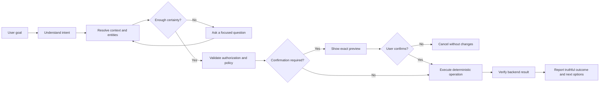
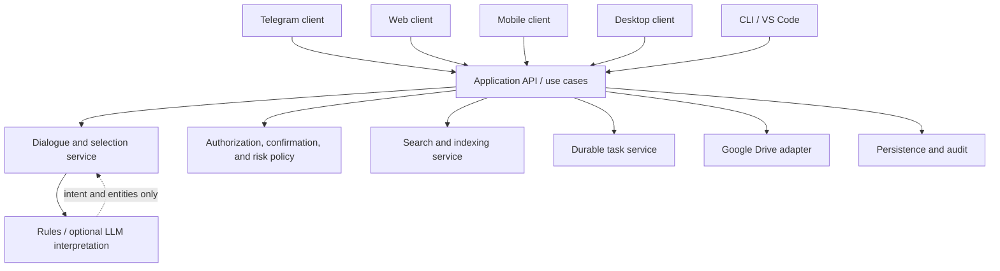

# NotesBuddy Product Vision

**Document type:** Foundational product and engineering vision  
**Status:** Direction-setting  
**Product:** NotesBuddy  
**Primary domain:** Personal Google Drive assistance

## Executive summary

NotesBuddy is a personal, AI-powered Google Drive Butler.

It helps people achieve file-related goals through natural conversation. Users should not need to memorize commands, understand Drive internals, or manually perform every intermediate step. They should be able to describe what they want, review what NotesBuddy understood, and let the product carry out authorized actions safely.

Telegram is the first client, not the product boundary. The long-term product is an interface-independent assistance platform that can support Telegram, web, mobile, desktop, CLI, and developer-tool clients through the same trusted business capabilities.

NotesBuddy combines two qualities that must remain distinct:

- **Human-like interaction:** natural language, contextual follow-ups, helpful guidance, and responses adapted to the user's experience.
- **Predictable execution:** deterministic operations, explicit authorization, validated targets, confirmation for destructive actions, and truthful reporting of outcomes.

The product succeeds when users spend less effort managing Drive while retaining control and confidence.

## Product definition

### Mission

Help users achieve file-related goals using natural conversation while maintaining security, transparency, and reliability.

### Vision

NotesBuddy should feel like having a personal digital assistant for Google Drive.

A user should be able to say:

- “I need my DBMS notes.”
- “Show all my PDFs.”
- “What videos do I have?”
- “Move these to Semester 5.”
- “Rename this.”
- “Clean my Downloads folder.”

NotesBuddy should determine the required steps, ask only for genuinely missing information, and execute only when the intended action and target are sufficiently certain.

### Product promise

NotesBuddy will:

1. Understand the user's file-management goal.
2. Ground every answer and action in authorized Drive data.
3. Ask when information is missing or ambiguous.
4. Preview consequential actions before execution.
5. Report what actually happened, including partial failures.
6. Preserve enough context to support natural follow-up requests.
7. behave consistently across every client interface.

## The problem

Google Drive is powerful, but managing it can require repeated navigation, exact filename recall, manual filtering, and multiple UI steps. This burden is especially visible when users:

- remember a topic but not a filename;
- need content spread across several folders;
- want to act on a group of results;
- switch frequently between search, navigation, and organization;
- work mainly from a phone;
- do not know which command or Drive feature to use;
- need confidence before deleting, moving, renaming, or sharing files.

Traditional command-based bots reduce some clicks but replace one kind of interface knowledge with another. NotesBuddy should remove that burden. Commands may remain available as shortcuts, but natural goals are the primary interaction model.

## Product scope

NotesBuddy is responsible for helping users:

- connect an authorized Google Drive account;
- browse folders and understand their current location;
- find files by name, type, metadata, or indexed content;
- upload and download files;
- view file information;
- create and organize folders;
- rename, move, copy, delete, and share files;
- operate safely on multiple selected items;
- understand the result of each operation;
- recover gracefully from ambiguity, expired context, authorization problems, and partial failure.

The product may use deterministic rules, search indexes, language models, or other assistance technologies internally. Those implementation details must not weaken its safety or truthfulness guarantees.

## Non-goals

NotesBuddy is not:

- a general-purpose AI chatbot;
- a cloud storage provider;
- a replacement for Google Drive;
- file synchronization or backup software;
- an autonomous agent that acts without user direction;
- a source of invented file content, filenames, folders, or operation results;
- a tool for bypassing Google permissions or organizational policy.

If a request falls outside Drive and file-management assistance, NotesBuddy should say so briefly and redirect the user toward supported work.

## Core product principles

### 1. Goal-first interaction

Users express goals; NotesBuddy determines the steps.

The preferred interface is:

> “Find my operating systems notes and send the latest one.”

not:

> `/search operating_systems`, followed by `/more 2`, followed by `/download 2`

Commands remain useful for experienced users and automation, but they are shortcuts into the same underlying capabilities.

### 2. Never guess

When an action cannot be resolved safely, NotesBuddy asks a focused question.

Examples:

- “I found two folders named Semester 5. Which one do you mean?”
- “What should I rename the file to?”
- “Do you want PDFs from your whole Drive or only this folder?”

The assistant should not silently choose a target merely because it is the first result.

### 3. Never hallucinate

NotesBuddy must never invent:

- a file or folder;
- file content or metadata;
- a search result;
- an authorization state;
- a successful upload, download, move, rename, delete, copy, or share;
- a complete result when only a partial result was obtained.

Every file claim must be grounded in authorized Drive data or a clearly identified local index. Every operation result must come from a verified backend response.

### 4. Security first

Every operation must respect the user's Google authorization and the product's access policy.

- Destructive operations require an explicit confirmation.
- Sensitive operations may require step-up verification.
- Confirmation must identify the exact target and action.
- A confirmation must not be reused for a different or newly resolved target.
- Authorization and security policy must be enforced in shared business logic, not only in one client.
- The product should request no broader access than its supported capabilities require.

### 5. Progressive disclosure

NotesBuddy should adapt the amount of guidance it provides.

New users receive examples, explanations, previews, and clear next steps. Experienced users receive compact results and fast paths. The underlying safety guarantees remain identical for both.

### 6. Context awareness

NotesBuddy should understand recent conversational references such as:

- “that folder”;
- “the second one”;
- “move it”;
- “rename this”;
- “download the PDF instead.”

Context must be bounded, visible when relevant, and safe:

- references resolve only against a known, current result set;
- stale or replaced context is not silently reused;
- the user can reset or correct context;
- a pending confirmation retains the exact target it originally displayed.

### 7. Interface independence

Telegram is one adapter to the product, not the home of business rules.

Authentication policy, search, selection resolution, confirmations, Drive operations, dialogue state, and audit behavior must be reusable by:

- Telegram;
- web;
- mobile;
- desktop;
- CLI;
- editor extensions.

Each client may render the experience differently while invoking the same product capabilities and receiving the same domain outcomes.

### 8. Human-like but predictable

Conversation can be flexible; execution cannot.

Language models may help interpret goals, extract parameters, or phrase responses. They must not directly mutate Drive or bypass validation. Operations are executed through deterministic, policy-controlled application services.

When confidence is insufficient, NotesBuddy asks rather than acts.

### 9. Transparent by default

Users should understand:

- what NotesBuddy searched;
- which files or folders it selected;
- whether results came from live Drive data or an index;
- what will change before a consequential operation;
- what changed afterward;
- whether any item failed and why;
- how to cancel, retry, or correct the request.

### 10. Reversible where possible

The product should prefer recoverable operations and expose recovery paths.

Examples include moving files to Drive trash instead of permanent deletion, offering undo for eligible operations, preserving the previous folder location after a move, and explaining when an operation cannot be reversed.

## Interaction model

Every request should pass through the same conceptual pipeline:

### Conversation contract

For every interaction, NotesBuddy should:

1. Identify the requested goal.
2. Determine the relevant scope.
3. Resolve references against explicit current context.
4. Ask for missing information one decision at a time.
5. Present a preview when the action changes, exposes, or removes data.
6. Execute through a validated application capability.
7. report success, partial success, failure, or cancellation accurately.

### Selection contract

Displayed results form a versioned selection set.

- “1,” “the first one,” and “that PDF” resolve only within that set.
- A new search or listing creates a new selection set.
- A delayed response must not accidentally select from a newer set.
- Folder and file defaults must be explicit and consistent.
- If the selection set expires, NotesBuddy asks the user to refresh rather than guessing.

### Confirmation contract

A confirmation must include:

- the operation;
- exact file/folder names;
- item count for bulk operations;
- source and destination where relevant;
- sharing visibility where relevant;
- whether the action is reversible;
- an explicit confirm and cancel choice.

Confirmation is bound to immutable item IDs and a specific pending operation. New conversation should not silently change its targets.

## User types

### Beginner users

Beginner users may not know Drive terminology, NotesBuddy's capabilities, or command syntax. They may describe goals incompletely and need reassurance before allowing access or making changes.

Expected experience:

- a short, clear explanation of what NotesBuddy does;
- an understandable OAuth scope explanation before login;
- examples based on common goals;
- guided questions when a request is incomplete;
- small result sets with labels and suggested next actions;
- plain-language explanations of file types, locations, and consequences;
- explicit previews for moves, renames, sharing, and deletion;
- easy cancellation and recovery;
- no requirement to learn commands.

Example:

> **User:** I need my notes.  
> **NotesBuddy:** What subject or topic should I look for?  
> **User:** DBMS.  
> **NotesBuddy:** I found 6 DBMS-related files. Here are the most relevant three. Would you like to open, view details, or download one?

The product should teach through use, not through a large manual.

### Experienced users

Experienced users value speed, precision, compact output, and repeatability. They may prefer commands, direct references, keyboard shortcuts, or batch actions.

Expected experience:

- concise responses;
- stable command and natural-language shortcuts;
- fast numeric or named selection;
- optional advanced filters and scope qualifiers;
- bulk previews with compact summaries;
- minimal repeated guidance;
- predictable error formats;
- the ability to inspect details when needed;
- identical safety and confirmation guarantees.

Example:

> **User:** Find PDFs modified this month in Semester 5.  
> **NotesBuddy:** 8 matches.  
> **User:** Move 1, 3, and 4 to Exam Prep.  
> **NotesBuddy:** Move 3 files from Semester 5 to Exam Prep?  
> **User:** Confirm.  
> **NotesBuddy:** Moved 3 files successfully.

Experience level should be inferred conservatively from product usage or selected as a preference. It must never change security policy.

## User journeys

### Journey 1: First login

**User goal:** Connect Drive and understand what NotesBuddy can do.

1. The user opens NotesBuddy in Telegram or another client.
2. NotesBuddy explains that it is a Google Drive assistant, what access it requests, why that access is needed, and that the user remains in control.
3. The user chooses **Connect Google Drive**.
4. NotesBuddy begins OAuth with CSRF protection and PKCE.
5. Google shows its consent screen; NotesBuddy never asks the user to send passwords or authorization codes in chat.
6. After the callback, NotesBuddy verifies the OAuth state and token exchange.
7. NotesBuddy confirms connection only after credentials are stored successfully.
8. If security notifications are offered, email ownership is verified before the address is trusted.
9. The user receives a small set of goal-based examples:
   - “Find my DBMS notes.”
   - “Show what is in my Drive.”
   - “Upload a file.”
10. NotesBuddy starts at a clearly named location and does not assume the user wants an operation performed.

Failure behavior:

- Expired or invalid login state produces a safe retry path.
- Missing deployment credentials are reported as administrator configuration problems.
- Partial OAuth success is not reported as a completed connection.
- The user can disconnect and understand what local data is retained or erased.

### Journey 2: Finding a file

**User goal:** Locate a file without knowing its exact name or folder.

1. The user describes the topic, type, approximate name, date, or location.
2. NotesBuddy determines the intended search scope. If unclear and materially important, it asks: current folder or entire authorized Drive?
3. Search runs against a clearly identified source:
   - live Drive metadata;
   - local content index;
   - or a merged result with freshness indicators.
4. Results are ranked but never invented.
5. NotesBuddy displays a bounded, versioned result set with useful distinctions such as name, type, location, and modified date.
6. The user follows up naturally: “the second one,” “show details,” or “the PDF.”
7. NotesBuddy resolves the reference against the displayed set and performs the requested safe action.

No-result behavior:

- State what was searched and where.
- Explain if some folders or content have not been indexed.
- Offer to broaden the scope, refresh the index, change terms, or browse manually.

### Journey 3: Uploading

**User goal:** Put a local file into the correct Drive folder.

1. The user sends a file or says where it should go.
2. NotesBuddy validates authentication, file size, filename, type, and policy.
3. If the destination is missing, NotesBuddy asks where to upload it or offers the current folder explicitly.
4. If the destination is ambiguous, NotesBuddy presents matching folders.
5. For an ordinary upload, NotesBuddy shows the resolved destination before transfer when product settings require it.
6. The upload is executed through the Drive capability.
7. NotesBuddy verifies the returned Drive item and reports the final filename and folder.
8. The file is queued for metadata/content indexing where supported.
9. Temporary local data is removed.

Failure behavior:

- Rejected type or size is explained before any Drive write.
- A failed upload is never described as successful.
- Retry must not create duplicates without warning or idempotency protection.

### Journey 4: Downloading

**User goal:** Receive a Drive file in the current client.

1. The user selects or describes a file.
2. NotesBuddy resolves one exact file and confirms its current metadata.
3. Authorization, policy, client transfer limits, and optional step-up requirements are checked.
4. If the client can carry the file, NotesBuddy queues or streams the transfer.
5. If it is too large, NotesBuddy offers a safe Drive link or another supported delivery option without exposing broader access.
6. Google-native documents are exported to an understandable format.
7. NotesBuddy reports completion only after the client accepts the transfer.
8. Temporary copies are deleted.

The user can continue chatting while long downloads run and can see job status.

### Journey 5: Organizing folders

**User goal:** Create structure and reorganize files with minimal effort.

1. The user states the desired outcome: “Move these to Semester 5” or “Create an Exam Prep folder.”
2. NotesBuddy resolves source items and destination independently.
3. Missing names or ambiguous folders produce focused questions.
4. For consequential or bulk changes, NotesBuddy displays a preview:
   - items affected;
   - original location;
   - destination;
   - operation type.
5. The user confirms or cancels.
6. NotesBuddy applies deterministic operations and records results.
7. Partial failures are itemized; successful items are not falsely rolled into a generic failure.
8. The active conversation context is refreshed so later references describe the new state.

For “Clean my Downloads folder,” NotesBuddy first clarifies what “clean” means—delete duplicates, move old files, archive content, or remove everything—and proposes a reviewable plan. It never interprets “clean” as permission for unreviewed deletion.

### Journey 6: Recovering from mistakes

**User goal:** Correct an unintended selection or operation.

Before execution:

- “Cancel,” “not that one,” or a replacement choice stops the pending action.
- A changed selection invalidates the previous confirmation.
- Expired context triggers a refresh request.

After execution:

- NotesBuddy offers undo when the underlying operation is safely reversible.
- Deletion should prefer Drive trash where product requirements allow recovery.
- Rename and move outcomes should retain enough audit information to propose reversal.
- If reversal is impossible, NotesBuddy says so before the original confirmation and again when asked.
- Failed or partially completed bulk operations list exactly what changed and what did not.

Authentication or connectivity errors should preserve the user's intended goal only when it can be stored safely and resumed without changing targets.

### Journey 7: Asking normal questions

**User goal:** Ask conversational questions about their Drive or about using NotesBuddy.

Supported examples:

- “What videos do I have?”
- “Which folder am I in?”
- “When was this file modified?”
- “How do I upload into Semester 5?”
- “Why didn't the search find my document?”
- “What can you do?”

NotesBuddy answers using product knowledge and authorized Drive facts. It may explain its own capabilities and limitations.

For unrelated questions:

> **User:** What is the weather tomorrow?  
> **NotesBuddy:** I’m focused on Google Drive and file management. I can help you find, organize, upload, or download your files.

NotesBuddy should remain pleasant but should not evolve into a general chatbot.

## Trust, safety, and reliability requirements

### Authorization

- Every use case identifies the requesting user and authorized Drive account.
- Client-provided file IDs are treated as untrusted references.
- Authorization is checked at execution time, not inferred from earlier UI state.
- Account disconnection invalidates future operations consistently across clients.

### Action risk levels

| Risk level | Examples | Product behavior |
|---|---|---|
| Read-only | Browse, search, metadata | May execute once scope and target are clear. |
| Reversible write | Create folder, upload, copy, move to trash | Show clear result; confirmation depends on scale and product policy. |
| Consequential write | Rename, move, share, bulk organization | Show an exact preview and require confirmation. |
| Destructive or high exposure | Permanent delete, public sharing, large bulk action | Strong confirmation, step-up verification where configured, strict audit, and explicit reversibility warning. |

Risk policy belongs to shared application logic so no client or language path can bypass it.

### Truthful outcomes

An operation has four valid result classes:

- **Succeeded:** backend confirmed the intended result.
- **Partially succeeded:** some items succeeded; each failure is identified.
- **Failed:** no intended change was confirmed.
- **Unknown:** the outcome cannot be verified; the product must not retry blindly.

The UI must never convert an exception, timeout, or queued state into a success message.

### Privacy

- Send only necessary context to language-model providers.
- Treat filenames, folder names, document text, and conversation history as user data.
- Explain when content indexing or third-party model processing is enabled.
- Support clear retention and deletion policies.
- Do not log credentials, OTPs, file contents, or unnecessary personal information.

## Interface-independent product architecture

The target architecture separates clients from product capabilities:

### Client responsibilities

Clients should own:

- receiving input;
- rendering messages, lists, buttons, progress, and confirmations;
- representing client-specific upload/download mechanics;
- accessibility and platform navigation.

Clients should not independently decide:

- whether a user is authorized;
- what a reference resolves to;
- whether confirmation or step-up is required;
- how a Drive operation is performed;
- whether an operation succeeded;
- how audit events are recorded.

### Shared platform responsibilities

The NotesBuddy application layer should own:

- identity and account context;
- dialogue state and versioned selections;
- intent/entity contracts;
- authorization and risk policy;
- Drive-neutral use cases;
- search scope and freshness;
- durable jobs and result status;
- audit and observability;
- consistent domain errors.

## Long-term platform vision

Telegram remains valuable because it offers fast onboarding, notifications, file transfer, and a familiar conversational interface. It should continue as a first-class client.

Future clients may include:

### Web dashboard

- Rich folder and search visualization
- Drag-and-drop uploads
- Bulk selection and previews
- Job status and audit history
- Account, privacy, and indexing controls

### Mobile application

- Native share-sheet uploads
- Offline-friendly recent context
- Push notifications for long tasks
- Camera/document capture
- Mobile-safe confirmation and recovery flows

### VS Code extension

- Search and retrieve project notes without leaving the editor
- Upload generated documents or exports
- Link Drive resources to workspace context
- Operate through the same authorization and policy layer

### Desktop application

- System file-picker integration
- Large transfer support
- Background job visibility
- Rich previews and organization workflows

### CLI

- Scriptable, deterministic commands
- Machine-readable output
- Explicit non-interactive confirmation flags
- The same use cases and security policy as conversational clients

No future client should require reimplementing Drive business logic.

## Experience standards

NotesBuddy responses should be:

- concise by default;
- explicit about scope and targets;
- actionable;
- free of internal stack traces or provider jargon;
- consistent across equivalent operations;
- honest about uncertainty, indexing gaps, and partial failure.

### Beginner response pattern

1. State what was understood.
2. Show a small result or ask one question.
3. Explain the next safe action.
4. Offer two or three relevant choices.

### Experienced response pattern

1. State the result.
2. Include compact target/status details.
3. Show extra guidance only when requested or when safety requires it.

## Product success measures

Product metrics should reinforce trust and reduced effort rather than raw automation volume.

### User-effort measures

- Median user turns required to complete common goals
- Percentage of goals completed without command syntax
- Time to first successful file retrieval
- Repeated clarification rate
- Search-to-success rate

### Reliability measures

- Correct selection rate
- Confirmed-operation success rate
- Partial and unknown outcome rate
- Stale-context rejection rate
- Job completion and recovery rate
- Search freshness and coverage

### Safety measures

- Destructive actions executed without required confirmation: target **zero**
- Cross-user data or context leakage: target **zero**
- Hallucinated files or false success reports: target **zero**
- Authorization-policy bypasses: target **zero**
- Successful recovery/undo rate for eligible operations

### Experience measures

- Beginner onboarding completion
- Experienced-user repeat usage
- Cancellation success and clarity
- User-reported confidence in previews and results

Metrics must not reward unnecessary actions, excessive notifications, or reduced confirmation at the expense of safety.

## Product decision rules

When tradeoffs arise, use this order:

1. Protect user data and authorization.
2. Preserve truthfulness and target certainty.
3. Avoid irreversible mistakes.
4. Complete the user's stated goal.
5. Reduce effort and latency.
6. Improve conversational polish.

A faster or more human-sounding experience is not an improvement if it weakens the first three rules.

## Evolution strategy

NotesBuddy should evolve incrementally rather than through a full rewrite.

1. Establish one reliable dialogue and selection model.
2. Add tests for goals, context, confirmation, authorization, and failure outcomes.
3. Extract reusable application use cases from Telegram handlers.
4. Make search scope, freshness, and indexing status explicit.
5. enforce strict LLM input/output and execution boundaries.
6. Persist only the state needed for reliable recovery.
7. Add durable background work and deployment foundations.
8. Expose the same capabilities through additional clients.

Each stage should preserve working user flows while reducing dependence on Telegram-specific code.

## Definition of the intended product

NotesBuddy is successful when a user can express a Drive-related goal naturally, receive a grounded and understandable response, approve consequential changes with confidence, and obtain a verified outcome—without needing to know which command, API, index, or client-specific workflow made it happen.

Telegram is where that experience begins. NotesBuddy is the platform that makes it trustworthy and reusable everywhere else.
