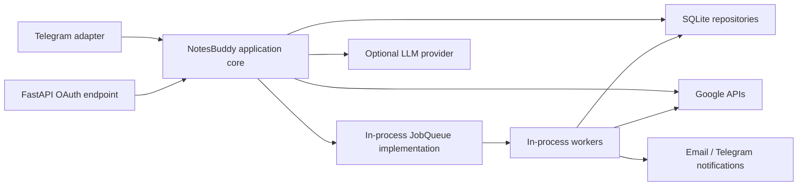
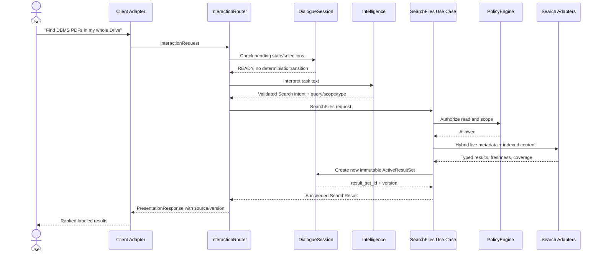
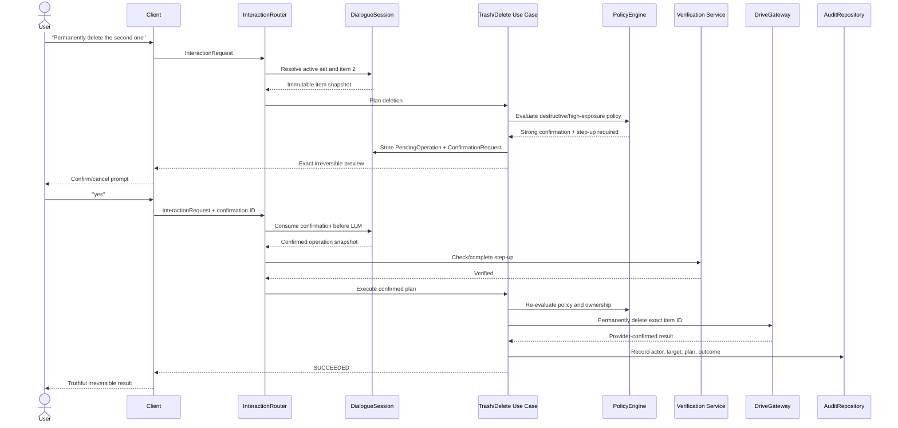
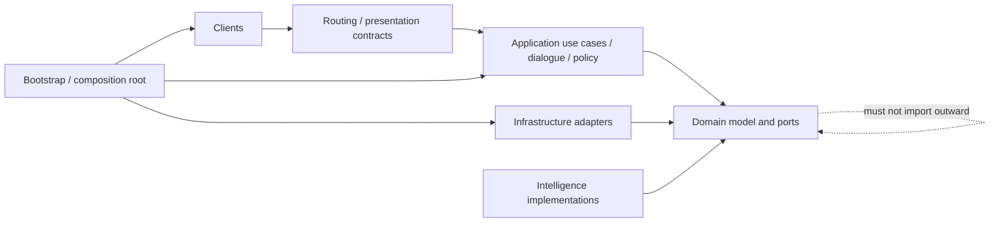
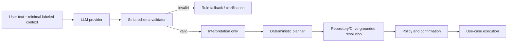

# NotesBuddy Target System Architecture

**Document type:** Target architecture and incremental migration design
**Status:** Proposed target; documentation only
**Date:** 2026-07-26
**Authoritative inputs:** `docs/CURRENT_ARCHITECTURE_AUDIT.md` and `docs/PRODUCT_VISION.md`

## Reading guide

This document uses three labels:

- **Current:** Behavior confirmed by the architecture audit.
- **Target:** A component, contract, or rule proposed here. It does not imply that implementation exists.
- **Migration:** An incremental step from current behavior toward the target.

The target is intentionally compatible with gradual extraction from the current repository. It does not require an immediate folder reorganization, database replacement, webhook conversion, or full rewrite.

## Executive summary

NotesBuddy should become an interface-independent application for safely accomplishing Google Drive goals. Telegram remains the first client, while web, mobile, desktop, CLI, and editor clients should eventually call the same application capabilities.

The target architecture separates flexible interpretation from deterministic execution:

1. A client converts platform events into transport-neutral interaction requests.
2. A deterministic interaction router resolves commands, pending verification, confirmations, missing slots, selections, and references before consulting NLP or an LLM.
3. One authoritative typed `DialogueSession` owns current folder, versioned results, pending work, and conversational references.
4. The intelligence layer may return only a strictly validated interpretation. It cannot access Drive, authorize actions, confirm risk, or report success.
5. Interface-independent use cases plan and execute operations through centralized policy checks and provider interfaces.
6. Infrastructure adapters implement Google Drive, OAuth, persistence, search, jobs, notifications, temporary storage, and time.
7. Typed outcomes distinguish success, partial success, failure, unknown outcome, cancellation, and queued work.
8. Client renderers transform response data into Telegram messages, web components, CLI output, or other platform-specific presentations.

The first migration priority is not package movement. It is behavior stabilization: characterization tests, one authoritative dialogue session, deterministic selection before NLP, and typed immutable pending operations. Use cases can then be extracted one operation at a time, beginning with browsing.

## Architectural goals

### Primary goals

1. **Goal-first interaction:** Users express file goals without needing commands.
2. **Deterministic execution:** Every operation target and parameter is validated outside the LLM.
3. **Truthful outcomes:** Only provider-confirmed outcomes are reported as successful.
4. **One dialogue authority:** Selection, pending work, and recent context have a single owner.
5. **Interface independence:** Telegram-specific objects and formatting stop at the client boundary.
6. **Uniform policy:** Equivalent actions receive identical authentication, risk, confirmation, verification, rate, anomaly, and audit treatment.
7. **Search transparency:** Scope, source, freshness, and indexing coverage are visible.
8. **Restart tolerance:** Credentials, consequential pending work, and background jobs can survive process restart.
9. **Incremental adoption:** Existing flows remain available while individual paths move behind new contracts.
10. **Provider replaceability:** Google, Gemini, SQLite, SMTP, Telegram, and an in-process queue remain adapters rather than domain dependencies.

### Quality attributes

| Attribute | Target property |
|---|---|
| Safety | No consequential operation without policy authorization and a target-bound confirmation. |
| Reliability | Idempotent writes where practical; explicit unknown outcomes when provider state cannot be verified. |
| Privacy | Minimal data sent to external models; secret and personal-data redaction by default. |
| Testability | Use cases, dialogue transitions, and policy decisions can run without Telegram or Google. |
| Portability | Client adapters share contracts and do not reimplement business decisions. |
| Operability | Structured logs, metrics, audit events, job visibility, and readiness checks. |
| Scalability | One-process SQLite deployment remains possible; repositories and queue ports permit later managed services. |
| Usability | Guided and Expert modes vary presentation, not authorization or execution policy. |

### Non-goals of this architecture phase

- Rewriting the current application.
- Renaming current modules immediately.
- Selecting a managed database or task-queue vendor now.
- Converting polling to webhooks now.
- Adding general-chat capabilities outside file and product assistance.
- Allowing an LLM to call Drive or application use cases.

## Current-to-target overview

### Current baseline

The audit confirms:

- one process runs Telegram polling, FastAPI OAuth callbacks, cleanup, and an in-memory task queue;
- Telegram commands, callbacks, and message handlers contain business orchestration;
- `bot.nav`, `nlp.context`, PTB `user_data`, and unused Copilot modules compete for dialogue ownership;
- result indices are flat, replaceable, and memory-only;
- plain numeric selection is not deterministically routed before NLP;
- pending operations are mutable dictionaries;
- policy checks differ by command, callback, and NLP path;
- local FTS search and live Drive search have different, insufficiently disclosed behavior;
- LLM JSON is loosely parsed and mapped intents can reach execution;
- job rows do not contain enough data for restart recovery.

### Target shape

| Current concentration | Target boundary |
|---|---|
| Telegram handler orchestration | Thin client adapter plus interaction router |
| `bot.nav` and `nlp.context` | One `DialogueSessionService` and repository |
| Mutable `user_data` dictionaries | Typed dialogue states and immutable operation snapshots |
| `nlp.router` parsing plus execution | Intelligence interpretation separated from application use cases |
| Repeated security checks | Central `PolicyEngine` and authorization context |
| Provider dictionaries | Typed domain objects and DTOs |
| `drive_service` plus audit writes | `DriveGateway` adapter plus application-owned audit policy |
| Mixed FTS/live search | Explicit search modes behind `SearchService` |
| In-process queue only | `JobQueue` port with recoverable job records |
| Telegram string formatting | Transport-neutral response model plus client renderers |
| Monolithic `db.models` | Domain-specific repositories over a shared SQLite implementation |

## Target architecture

```mermaid
flowchart TB
    subgraph Clients["1. Client / Interface Layer"]
        TG["Telegram"]
        WEB["Web"]
        MOB["Mobile"]
        DESK["Desktop"]
        CLI["CLI"]
        VSC["VS Code"]
    end

    subgraph Routing["2. Message and Interaction Routing"]
        ADAPT["Client event adapters"]
        ROUTER["Deterministic InteractionRouter"]
        RESP["Response presentation model"]
    end

    subgraph Dialogue["3. Dialogue and Selection"]
        SESSION["DialogueSessionService"]
        SELECT["Selection and reference resolver"]
        PLANSTATE["Slots / confirmation / verification state"]
    end

    subgraph Intelligence["4. Intelligence / Interpretation"]
        RULES["Rules, normalization, fuzzy matching"]
        NLU["Intent and entity classifier"]
        LLM["Optional LLM adapter"]
        SCHEMA["Strict Interpretation schema"]
    end

    subgraph Application["5. Application Use-Case Layer"]
        UC["Use-case handlers"]
        PLANNER["Operation planner"]
        OUTCOME["Typed outcomes"]
    end

    subgraph Policy["6. Policy and Authorization"]
        AUTHZ["Identity, account, allowlist"]
        RISK["Risk and confirmation policy"]
        STEP["Step-up, rate, anomaly, limits, audit policy"]
    end

    subgraph Domain["7. Domain Model"]
        MODEL["Items, search, selections, plans, results, jobs"]
        ERR["Domain errors"]
        PORTS["Ports / protocols"]
    end

    subgraph Infra["8. Infrastructure Adapters"]
        DRIVE["Google Drive adapter"]
        OAUTH["Google OAuth adapter"]
        SEARCH["Index / FTS / cache adapters"]
        NOTIFY["Email and client notification adapters"]
        SANDBOX["File sandbox"]
        CLOCK["Clock"]
    end

    subgraph Persistence["9. Persistence"]
        REPOS["Typed repositories"]
        SQL["SQLite initially / managed DB later"]
    end

    subgraph Jobs["10. Background Job System"]
        QUEUE["JobQueue port"]
        WORKERS["Workers"]
        JOBREPO["Recoverable job state"]
    end

    subgraph Obs["11. Observability"]
        LOGS["Structured logs"]
        METRICS["Metrics and health"]
        AUDIT["Audit event sink"]
    end

    TG & WEB & MOB & DESK & CLI & VSC --> ADAPT
    ADAPT --> ROUTER
    ROUTER --> SESSION
    SESSION --> SELECT
    ROUTER --> RULES
    RULES --> NLU
    NLU -. "optional" .-> LLM
    LLM --> SCHEMA
    SCHEMA --> ROUTER
    ROUTER --> UC
    UC --> PLANNER
    UC --> AUTHZ
    AUTHZ --> RISK
    RISK --> STEP
    UC --> MODEL
    UC --> PORTS
    PORTS --> DRIVE & OAUTH & SEARCH & NOTIFY & SANDBOX & CLOCK & REPOS & QUEUE
    REPOS --> SQL
    QUEUE --> WORKERS
    WORKERS --> JOBREPO
    JOBREPO --> SQL
    UC --> OUTCOME
    OUTCOME --> RESP
    RESP --> Clients
    UC & WORKERS --> LOGS
    UC & WORKERS --> METRICS
    STEP --> AUDIT
```



### Runtime component view

The logical layers do not require separate services initially. The first target deployment may remain one Python process:



Later, without changing use-case contracts, SQLite can be replaced by PostgreSQL and the in-process queue by a durable broker/worker deployment.

## Layer responsibilities

## 1. Client / Interface Layer

### Allowed responsibilities

Clients may:

- receive user input and client events;
- normalize platform identifiers into a `ClientContext`;
- render text, result lists, files, buttons, warnings, progress, and confirmation controls;
- attach result-set and confirmation identifiers to buttons/callbacks;
- translate commands, callbacks, messages, uploads, and UI actions into `InteractionRequest` objects;
- deliver downloads and collect uploads using client-specific mechanisms;
- display job notifications and allow cancellation where supported;
- apply accessibility, localization, and client layout rules.

### Prohibited decisions

Clients must not decide:

- whether a user is authenticated or allowed;
- which account owns or may access an item;
- which item “1,” “first,” or “that file” identifies;
- operation risk level;
- whether confirmation or step-up is required;
- Drive API parameters or Shared Drive behavior;
- whether provider execution succeeded;
- audit requirements or retention;
- search freshness or result truth.

### Telegram target adapter

The Telegram adapter should eventually contain:

- PTB handler registration;
- conversion from `Update` to `InteractionRequest`;
- Telegram upload/download transport;
- callback encoding/decoding with signed or opaque identifiers;
- Telegram renderer for the response model;
- delivery of asynchronous job notifications.

It should not import a Google client, SQLite helper, LLM SDK, or operation-specific policy implementation.

## 2. Message and Interaction Routing Layer

### Request contract

```text
InteractionRequest
  request_id
  session_key
  user_identity
  client_context
  event_kind            # command, callback, text, upload, job_action
  raw_text?
  explicit_action?
  callback_token?
  uploaded_file_ref?
  reply_to_message_id?
  observed_state_version?
  received_at
```

### Deterministic precedence

The target `InteractionRouter` processes incoming events in this exact order:

1. **Explicit client command or callback**
2. **Pending step-up verification**
3. **Pending confirmation**
4. **Pending missing-slot answer**
5. **Active result selection**
6. **Contextual reference resolution**
7. **Deterministic NLP or optional LLM interpretation**
8. **General product conversation**
9. **Safe unsupported-request fallback**

An explicit `/cancel` or cancel callback is recognized at the first stage and safely cancels compatible pending state. It cannot be consumed as a folder name or LLM prompt.

### Why dialogue precedes intelligence

Messages such as `1`, `first`, `yes`, `Projects`, and `cancel` are meaningful only in state:

- `1` may select result 1.
- `first` is an ordinal selection.
- `yes` may confirm an immutable pending operation.
- `Projects` may fill a requested destination-folder slot.
- `cancel` may cancel a confirmation, slot request, verification, upload, or job.

Sending these messages to an LLM first allows probabilistic interpretation to override deterministic state. The target router therefore asks the dialogue layer whether the current state has an exact transition before intelligence is consulted.

### Router output

Routing produces one of:

- a completed `PresentationResponse`;
- a `UseCaseRequest`;
- a `DialogueTransition` requiring another user response;
- a safe unsupported response;
- a transport-neutral error.

The router does not call Drive directly.

## 3. Dialogue and Selection Layer

### Recommended session identity

**Target decision:** Key dialogue by a future-compatible `ClientSessionIdentity`, not Telegram user alone.

```text
ClientSessionIdentity
  principal_id          # stable NotesBuddy user identity
  client_type           # telegram, web, mobile, cli, ...
  conversation_id       # chat, browser session, workspace, terminal session
  thread_id?            # Telegram topic/web thread where applicable
```

For Telegram, the initial mapping should be `(principal_id, "telegram", chat_id, message_thread_id?)`, where `principal_id` is linked to the Telegram user.

Why this is safest:

- Telegram user-only state collides across private chats, groups, and topics.
- `(Telegram user, chat)` solves today's collision but bakes a client into the model.
- A client-session key isolates concurrent conversations while keeping Drive account ownership on the stable principal.
- Cross-client continuity can later be an explicit “continue session” feature, not accidental shared mutable state.

Account data, favorites, security preferences, and audit identity remain principal-scoped. Dialogue state is session-scoped.

### Authoritative `DialogueSession`

```text
DialogueSession
  session_id
  session_key: ClientSessionIdentity
  principal_id
  account_id?
  state: DialogueState
  current_folder: FolderLocation
  folder_history: list[FolderLocation]
  active_result_set: ActiveResultSet?
  pending_operation: PendingOperation?
  confirmation: ConfirmationRequest?
  slot_request: SlotRequest?
  step_up_reference: StepUpReference?
  last_selected_item: SelectedItemRef?
  experience_mode: ExperienceMode
  file_selection_behavior: FileSelectionBehavior
  state_version
  created_at
  updated_at
  expires_at
```

The session service owns transitions and enforces optimistic version checks. No client or use case mutates session dictionaries directly.

### `DialogueState`

Recommended values:

- `READY`
- `AWAITING_SLOT`
- `AWAITING_CONFIRMATION`
- `AWAITING_STEP_UP`
- `AWAITING_UPLOAD`
- `JOB_QUEUED`
- `EXPIRED`
- `CANCELLED`

State is explicit even when optional objects are absent. Invalid transitions fail safely.

### `ActiveResultSet`

```text
ActiveResultSet
  result_set_id          # opaque UUID
  version                # monotonic within session
  source                 # LIVE_DRIVE, LOCAL_INDEX, HYBRID, RECENT, FAVORITES, BROWSE
  query?
  scope
  folder_id?
  items: tuple[ResultItem, ...]
  coverage
  freshness
  created_at
  expires_at
  originating_request_id
  rendered_message_ids   # optional client correlation, not selection authority
```

Every new browse, search, recent, favorites, or suggestion view creates a new immutable result set and atomically replaces the active set.

### `ResultItem`

```text
ResultItem
  ordinal                # 1-based display position
  item_id                # immutable Drive ID
  account_id
  name_snapshot
  item_kind              # FILE, FOLDER, SHORTCUT
  mime_type?
  parent_ids
  shortcut_target_id?
  shortcut_target_kind?
  modified_at?
  size_bytes?
  source
  freshness
  capabilities
```

The name and metadata are snapshots for display and confirmation. Execution revalidates the live target/capability when required.

### Selection rules

1. Numeric and ordinal references resolve only against the active, unexpired result set.
2. Callback selections carry opaque `result_set_id`, `version`, and ordinal/item reference; a version mismatch yields `ExpiredContext`.
3. A client should attach `observed_state_version` or reply-message correlation where possible.
4. Plain text without a version resolves only when one unexpired active result set exists and no intervening ambiguous dialogue transition occurred.
5. If a recently replaced set makes a delayed plain reply ambiguous, the router asks the user to choose from the current list instead of guessing.
6. Result items are immutable. A new view produces a new set rather than mutating indices in place.
7. Folder default action is `OPEN`.
8. File behavior is an explicit `FileSelectionBehavior` preference: `SHOW_DETAILS`, `DOWNLOAD`, or `ASK`.
9. Recommended default is `SHOW_DETAILS`; a user may opt into `DOWNLOAD`. The LLM cannot change this preference.
10. Shortcut resolution validates the live target and prevents navigation loops.

### `PendingOperation`

```text
PendingOperation
  operation_id
  operation_type
  principal_id
  account_id
  session_id
  source_result_set_id?
  source_result_version?
  targets: tuple[ItemSnapshot, ...]
  parameters             # typed per operation
  risk_level
  policy_decision_id
  idempotency_key
  status
  created_at
  expires_at
```

Targets contain immutable Drive IDs, account ID, names, kinds, source parents, and relevant capabilities. A pending operation never re-resolves “1” at confirmation time.

### `ConfirmationRequest`

```text
ConfirmationRequest
  confirmation_id
  operation_id
  summary
  target_snapshots
  consequence
  reversible
  required_phrase_or_action
  policy_version
  created_at
  expires_at
  status                 # PENDING, CONFIRMED, DENIED, EXPIRED, CONSUMED
```

Confirmation is single-use and bound to the operation and policy decision. Editing the plan creates a new confirmation.

### `SlotRequest`

```text
SlotRequest
  slot_request_id
  operation_draft_id
  slot_name
  expected_type
  allowed_values?
  prompt_key
  attempts
  created_at
  expires_at
```

Slot answers are parsed and validated according to the expected type before updating an operation draft.

### `ExperienceMode`

- `GUIDED`
- `EXPERT`

Experience mode changes result page size, explanations, examples, and suggestions. It does not change risk, authorization, confirmation, verification, provider validation, or audit behavior.

### Cancellation and expiry

- Cancel transitions pending confirmation/slot/verification/upload state to `CANCELLED`.
- Cancellation must not delete the active result set unless the user asks to clear context.
- Expired confirmation, slot, result, and step-up references are rejected independently.
- Expiry clears secrets and unusable pending state; retained audit metadata must not contain OTPs or file contents.
- A restart reloads persisted consequential pending state and either resumes safely or marks it expired. It never silently executes.

## 4. Intelligence / Interpretation Layer

### Permitted capabilities

The intelligence layer may use:

- deterministic phrase and command rules;
- typo and abbreviation normalization;
- numeric/ordinal extraction;
- fuzzy candidate matching;
- intent classification;
- entity extraction;
- query/scope interpretation;
- conversational-category classification;
- optional semantic or LLM interpretation.

### Strict output contract

```text
Interpretation
  schema_version
  intent: IntentType
  entities: EntitySet
  confidence: float [0, 1]
  missing_fields: tuple[SlotName, ...]
  category: TASK | PRODUCT_HELP | GREETING | OFF_TOPIC | UNKNOWN
  clarification_key?
  clarification_arguments?
  source: RULE | CLASSIFIER | LLM
  model_metadata?        # model/version/latency only; no raw private prompt
```

`EntitySet` is a strict discriminated union. For example:

- `SearchEntities(query, scope?, file_types?, date_range?)`
- `MoveEntities(item_reference?, destination_reference?)`
- `RenameEntities(item_reference?, new_name?)`
- `CreateFolderEntities(name?, parent_reference?)`

Unknown fields are rejected. Strings are length-limited and normalized. IDs are never accepted from model output as trusted Drive IDs.

### Validation process

1. Provider returns JSON or a typed response.
2. Parse with a strict schema library or equivalent explicit validator.
3. Reject unknown intent values, wrong types, missing required top-level fields, invalid confidence, oversized values, and unrecognized entity combinations.
4. Normalize text but preserve the user's original input separately.
5. Convert all item/folder references into unresolved domain references, never IDs.
6. Apply confidence policy.
7. Send the validated interpretation back to the router/application planner.

Invalid output is treated as provider failure and falls back to deterministic interpretation or clarification.

### Confidence behavior

| Confidence | Behavior |
|---|---|
| High | Continue to deterministic planning; still resolve targets, enforce policy, and ask for required slots. |
| Medium | Present bounded choices or ask one focused clarification. Do not choose a consequential target. |
| Low | Use deterministic fallback if it yields a stronger result; otherwise ask clarification or show supported examples. |

Confidence thresholds are configurable and calibrated with tests, but cannot override operation-risk policy.

### Prohibited capabilities

The intelligence layer must never:

- call Google Drive, OAuth, repositories, task workers, or client APIs;
- generate or select a Drive ID;
- determine account ownership or authorization;
- decide that confirmation or step-up may be skipped;
- execute a use case;
- claim a provider operation succeeded;
- invent files, folders, metadata, or result counts;
- add an action not present in the application's allowed action catalog.

### LLM-unavailable behavior

NotesBuddy must continue to support:

- explicit commands/callbacks;
- pending dialogue transitions;
- numeric/ordinal selection;
- contextual references already grounded in dialogue;
- deterministic intent/entity rules;
- search and all use cases;
- product-help and safe fallback responses.

The LLM improves interpretation breadth, not core availability.

## 5. Application Use-Case Layer

### Use-case contract

Every use case:

- accepts a plain typed request;
- receives `ExecutionContext` containing principal, account, session, client capabilities, request ID, and time;
- requests one centralized policy decision;
- calls domain services and infrastructure ports;
- returns a typed `UseCaseOutcome`;
- emits required audit events;
- does not import Telegram, FastAPI, Google SDK, SQLite, Gemini, or client formatters.

### Required use cases

| Use case | Input highlights | Target responsibility |
|---|---|---|
| `ConnectDriveAccount` | principal, OAuth initiation/callback data | Start/complete OAuth through provider port; bind account; persist credentials including expiry. |
| `DisconnectDriveAccount` | principal, account, retention choice | Revoke provider credential, disable account, apply data-retention policy. |
| `BrowseFolder` | account, folder reference, paging | Validate access; list one folder; return typed items and create a result-set candidate. |
| `OpenFolder` | session, resolved folder | Validate live folder/shortcut; update folder history; invoke browse. |
| `GoBack` | session | Pop typed folder history safely and browse resulting location. |
| `GetCurrentLocation` | session | Return current folder path without provider mutation. |
| `SearchFiles` | query, mode, scope, filters | Run explicit live/index/hybrid search; rank, deduplicate, label freshness/source. |
| `ResolveSelection` | session, result-set ID/version, reference | Resolve only against the authoritative active set and return a typed selection. |
| `GetFileDetails` | account, item ID | Revalidate and return typed metadata/capabilities. |
| `DownloadFile` | account, item ID, delivery capabilities | Plan direct delivery/link/export; enqueue when long-running. |
| `UploadFile` | account, upload reference, destination, idempotency key | Validate file/destination; enqueue or execute; index on confirmed success. |
| `CreateFolder` | account, parent ID, name | Validate and create; return provider-confirmed folder. |
| `RenameItem` | account, item ID, name, confirmation token | Revalidate target and execute target-bound plan. |
| `MoveItem` | account, item IDs, destination, confirmation token | Validate parents/destination/capabilities; support partial result. |
| `CopyItem` | account, item IDs, destination/name | Copy with limits and typed result. |
| `TrashItem` | account, item IDs, confirmation token | Prefer recoverable trash semantics and audit prior state. |
| `PermanentlyDeleteItem` | account, item IDs, strong confirmation/step-up | Optional retained capability; irreversible delete with highest risk policy. |
| `CreateZip` | resolved immutable items or explicit search plan | Enforce counts/bytes; create recoverable background job. |
| `CreateShareLink` | account, item ID, exposure/role, confirmation | Validate capability and exposure policy; never assume “anyone” permission. |
| `AddFavorite` | principal, account, item ID | Store verified account-scoped reference. |
| `RemoveFavorite` | principal, account, item ID | Remove preference. |
| `ListRecentItems` | account, limit | Query provider and create a labeled result set. |
| `IndexFolder` | account, folder, depth/options | Create indexing jobs and record coverage. |
| `RefreshIndex` | account, scope | Reconcile modified/deleted/moved items and coverage. |
| `GetJobStatus` | principal, job ID | Enforce ownership and return status/progress/outcome. |
| `ManageSecurityPreferences` | principal/account preferences | Manage verified notification channels, step-up, exposure, and retention preferences. |

### Planning versus execution

Consequential use cases use two phases:

1. **Plan:** resolve immutable targets, validate basic capabilities, classify risk, and return `OperationPlan` plus required confirmation/step-up.
2. **Execute:** consume the confirmed plan, revalidate policy and critical provider state, use its idempotency key, execute, and return an outcome.

This prevents a later result-set change from retargeting an approved operation.

## 6. Policy and Authorization Layer

### Central responsibilities

The `PolicyEngine` centralizes:

- authenticated principal and active Drive account;
- allowlist/tenant/access policy;
- account ownership;
- operation risk;
- confirmation requirements;
- OTP or other step-up verification;
- per-user, per-account, per-client, and global rate limits;
- anomaly detection and response;
- file-size/type limits;
- sharing exposure and roles;
- bulk item/byte limits;
- audit requirements and retention category.

All entry paths—slash command, callback, numeric selection, rule NLP, LLM interpretation, web API, mobile, CLI—must request the same policy decision for the same use case.

### Policy decision

```text
PolicyDecision
  decision_id
  policy_version
  principal_id
  account_id
  operation
  risk_level
  allowed
  denial_reason?
  confirmation_requirement
  verification_requirement
  rate_limit
  bulk_limits
  file_limits
  audit_requirement
  expires_at
```

Policy is evaluated again immediately before execution. Confirmation and verification refer to the decision ID and operation ID.

### Risk levels

| Level | Examples | Confirmation | Step-up | Audit |
|---|---|---|---|---|
| `READ_ONLY` | Browse, search, metadata, current location, recent | None once target/scope is clear | Normally none | Security/access telemetry; detailed audit optional |
| `REVERSIBLE_WRITE` | Upload, create folder, copy, add favorite, move to trash | Summary for bulk or ambiguous destination; otherwise configurable | Based on file/tenant policy | Required for Drive writes |
| `CONSEQUENTIAL_WRITE` | Rename, move, restore, restricted sharing, bulk organization | Exact target-bound confirmation | Policy-based, especially bulk/cross-drive | Required with before/after data |
| `DESTRUCTIVE_HIGH_EXPOSURE` | Permanent delete, public link, large bulk action, account disconnect | Strong explicit confirmation with consequence | Required by default | Required, security-significant |

Experience mode never changes this table.

### Anomaly response

Anomaly detection produces a policy/security event. Response is scoped to the affected principal/account by default. Global revocation requires an explicit administrative incident policy, not an automatic user-triggered threshold.

Long revocation and alert work is queued. The application immediately prevents new sensitive actions through account/security state while response jobs complete.

## 7. Domain Model

### Core objects

| Object | Purpose |
|---|---|
| `UserIdentity` | Stable NotesBuddy principal and linked client identities. |
| `DriveAccount` | Provider account, owner, scopes, connection status, credential reference, and token expiry metadata. |
| `DriveItem` | Base item with account-scoped ID, name, kind, parents, metadata, capabilities, and freshness. |
| `Folder` | `DriveItem` specialization supporting navigation and child listing. |
| `File` | `DriveItem` specialization with MIME, size, export/download capabilities, checksum where available. |
| `SearchQuery` | Text, filters, mode, requested scope, paging, and sort. |
| `SearchScope` | Current folder, selected folder tree, My Drive, Shared Drive, or entire authorized scope. |
| `SearchResult` | Items plus source, coverage, freshness, ranking explanation, paging, and partial warnings. |
| `SelectionSet` | Domain equivalent of the immutable versioned active result set. |
| `OperationPlan` | Exact targets/parameters, risk, reversibility, policy decision, idempotency key, and expiry. |
| `OperationResult` | Outcome status, confirmed changes, provider references, failures, and verification evidence. |
| `PartialFailure` | Item/phase/error category/retryability without raw provider secrets. |
| `AuditEvent` | Actor, account, operation, targets, policy, outcome, request/job correlation, and timestamp. |
| `BackgroundJob` | Owner, type, payload reference, status, progress, retry/idempotency data, and outcome. |
| `SecurityPreference` | Verified notification channel, step-up settings, sharing defaults, retention choices. |

### Outcome model

```text
OutcomeStatus
  SUCCEEDED
  PARTIALLY_SUCCEEDED
  FAILED
  UNKNOWN
  CANCELLED
  QUEUED
```

- `SUCCEEDED`: Provider-confirmed intended state.
- `PARTIALLY_SUCCEEDED`: Some targets changed; successes and failures are explicit.
- `FAILED`: No intended change was confirmed.
- `UNKNOWN`: A timeout or ambiguous provider result prevents verification. Automatic blind retry is prohibited.
- `CANCELLED`: User/system cancelled before completion; any completed side effects are still reported.
- `QUEUED`: Work was accepted, not completed; includes a job ID.

Provider exceptions never become success strings. A queued acknowledgment is not a completed operation.

## 8. Infrastructure Adapters

### Ports

Application/domain interfaces should include:

- `DriveGateway`
- `OAuthProvider`
- `UserRepository`
- `AccountRepository`
- `DialogueSessionRepository`
- `ResultSetRepository`
- `PendingOperationRepository`
- `SecurityPreferenceRepository`
- `AuditRepository`
- `JobRepository`
- `SearchMetadataRepository`
- `ContentIndex`
- `FullTextSearch`
- `Cache`
- `InterpretationProvider`
- `EmailProvider`
- `ClientNotificationGateway`
- `FileSandbox`
- `JobQueue`
- `Clock`

Adapters implement these interfaces; use cases receive them by composition/bootstrap.

### Google Drive adapter rules

The Google adapter:

- imports no Telegram or client renderer code;
- accepts and returns typed application/domain data;
- does not phrase user messages;
- does not decide confirmation, step-up, rate, or audit policy;
- maps provider failures to transport-neutral error categories;
- supports My Drive and Shared Drives explicitly;
- identifies corpus/scope and partial/incomplete results;
- resolves shortcuts without losing source and target identity;
- exposes parents, capabilities, size, modified time, checksums, links, and export options needed for validation/indexing;
- supports pagination and cancellation where the API permits;
- uses bounded retry only for safe retryable operations;
- accepts idempotency/operation correlation where provider semantics allow it.

Audit events are emitted by application policy/use cases, not hidden inside the Drive adapter.

### Other adapter rules

- OAuth adapter persists/returns expiry, scopes, and provider account identity.
- Search adapters identify source and coverage.
- LLM adapter sees the minimum necessary, labeled untrusted context.
- Email adapter sends verified templates and returns delivery acceptance, not guaranteed human receipt.
- Notification adapter delivers already-approved presentation data.
- File sandbox returns opaque handles and enforces user/job isolation and quotas.
- Clock is injected into expiry, rate, and test logic.

## 9. Search architecture

### Search modes

```text
SearchMode
  LIVE_METADATA
  INDEXED_CONTENT
  HYBRID
  RECENT
  FAVORITES
```

Scopes are independent:

```text
SearchScope
  CURRENT_FOLDER
  FOLDER_TREE(folder_id)
  MY_DRIVE
  SHARED_DRIVE(drive_id)
  ENTIRE_AUTHORIZED_SCOPE
```

Filters may include file type, modified/created range, size, owner/shared status, and item kind.

### Recommended defaults

- Natural requests such as “find DBMS notes” default to `HYBRID` over `ENTIRE_AUTHORIZED_SCOPE`, subject to account permissions and cost/latency limits.
- Requests containing “here,” “in this folder,” or equivalent default to `CURRENT_FOLDER`.
- Browse is not search; it lists one folder live.
- Explicit client controls may let users select live metadata versus indexed content.
- If the index has insufficient coverage, hybrid search must still return live metadata matches and label content limitations.

This default should receive an ADR before implementation because it affects latency, quota, privacy, and user expectations.

### Search pipeline

1. Validate query, filters, account, and scope.
2. Run live metadata and/or local index queries according to mode.
3. Normalize items into account-scoped `DriveItem` identities.
4. Deduplicate by `(account_id, item_id)`.
5. Attach source contributions and freshness.
6. Drop or mark stale index-only results after live verification according to policy.
7. Rank using deterministic relevance, recency, type/scope match, and optional user preferences.
8. Return coverage and partial warnings.
9. Create a new immutable `ActiveResultSet`.

### Freshness and coverage

Every result response includes:

- source: live, index, or merged;
- index coverage scope and last refresh time;
- per-item or result-level freshness;
- whether results may be incomplete;
- live verification state for index-only items.

Index coverage records:

- account/scope;
- folders traversed;
- last scan cursor/time;
- items indexed/skipped/failed;
- extractor/OCR capability;
- version.

### Synchronization

- Confirmed upload/create/copy updates metadata and schedules extraction.
- Confirmed rename/move updates metadata and FTS display fields.
- Trash/permanent delete removes or tombstones index rows.
- Provider change notifications or periodic reconciliation may be added later.
- Search-time live verification handles stale items until synchronization matures.
- Content hashes and modified times decide whether extraction is needed.
- Google Workspace export MIME/name are recorded for correct extraction.

### Result-context rule

Every new search creates a new result set. Previous results are used only for explicit follow-up references while their set remains active and unexpired. They are never the implicit corpus for a new search.

The response always states whether it came from live Drive, the local index, or a merged source.

## 10. Persistence

### Repository separation

| Repository | Data |
|---|---|
| `UserRepository` | Principals and linked client identities |
| `AccountRepository` | Drive account metadata, credential reference, scopes, expiry, status |
| `CredentialRepository` | Encrypted token material and key version |
| `DialogueSessionRepository` | Session state/version/current folder/history/experience mode |
| `ResultSetRepository` | Active immutable result sets and TTL |
| `PendingOperationRepository` | Draft/confirmed plans and idempotency |
| `VerificationRepository` | Hashed OTP/challenge, attempts, expiry, consumed state |
| `SecurityPreferenceRepository` | Verified channels and security preferences |
| `AuditRepository` | Immutable audit events and retention metadata |
| `JobRepository` | Complete recoverable job state |
| `SearchMetadataRepository` | Item metadata, tombstones, coverage, freshness |
| `ContentIndex` | Extracted searchable content/FTS |
| `BehaviorRepository` | Explicitly permitted preference signals |
| `NotificationRepository` | Delivery attempts and status where needed |

### Must survive restart

- user and account linkage;
- encrypted OAuth credentials, expiry, scopes, and status;
- verified security preferences;
- audit events;
- complete background job payload/status/idempotency/outcome;
- index metadata, FTS content, coverage, and tombstones;
- consequential pending operations, confirmations, and verification references until expiry;
- dialogue current folder and active result set when reliable follow-up after restart is a product requirement.

### May remain memory-only initially

- repository read caches;
- rendered Telegram message objects;
- raw LLM responses after validated interpretation;
- ephemeral response phrasing;
- in-flight provider client instances;
- short-lived per-process metrics buffers;
- non-authoritative performance caches.

Rate-limit/anomaly counters may be memory-only in the single-process phase, but their port must permit a shared cache/database implementation before multiple replicas.

### SQLite-first design

- Keep SQLite initially behind typed repositories.
- Use explicit transaction boundaries in use cases/repository services.
- Store UTC timestamps and schema versions.
- Use opaque IDs and avoid SQLite-specific types in domain contracts.
- Keep FTS behind a `FullTextSearch` port.
- Add repository contract tests that can later run against PostgreSQL.
- Do not require a database migration during this documentation phase.

## 11. Background job system

### Job types

- Drive download and client delivery
- Upload where client/provider duration warrants it
- ZIP generation
- OCR
- document extraction
- indexing and index refresh
- email delivery
- anomaly response and token revocation
- cleanup/reconciliation

### Job contract

```text
BackgroundJob
  job_id
  owner_principal_id
  account_id?
  session_id?
  client_delivery_ref?
  type
  schema_version
  payload                 # typed, complete, encrypted/referenced as needed
  idempotency_key
  status
  progress
  attempt_count
  max_attempts
  next_attempt_at?
  cancellation_requested
  result?
  error_category?
  created_at
  started_at?
  heartbeat_at?
  completed_at?
```

Statuses:

`QUEUED → RUNNING → SUCCEEDED | PARTIALLY_SUCCEEDED | FAILED | UNKNOWN | CANCELLED`

`RETRY_WAIT` may occur between attempts.

### Required behavior

- Persist the job before enqueue acknowledgment.
- Return `QUEUED` with job ID immediately so the user can continue chatting.
- Workers claim jobs with a lease/heartbeat.
- Startup reconciles expired leases and safely retries only retryable/idempotent work.
- Idempotency keys prevent duplicate uploads/writes where feasible.
- Destructive plans are never reconstructed from free text inside a worker.
- Cancellation is best effort and reports already completed effects.
- Progress is monotonic and phase-based when exact bytes are unavailable.
- Failure stores a safe category and diagnostic correlation, not raw credentials/content.
- Client delivery is a separate phase; Drive download success does not imply Telegram delivery success.

### Retry policy

- Retry transient provider/network failures with bounded exponential backoff and jitter.
- Do not automatically retry permanent authorization, validation, quota-policy, or unsupported errors.
- Do not blindly retry `UNKNOWN` write outcomes; verify provider state first.
- ZIP and extraction jobs enforce cumulative byte/disk/time quotas during execution.
- Jobs that exceed policy fail safely and clean temporary data.

### Immediate acknowledgment sequence

See the background download sequence below. Other long work follows the same accept/notify/status model.

## 12. Observability

### Structured logs

Every log event should include, when applicable:

- timestamp and severity;
- request/correlation ID;
- session ID;
- principal/account opaque IDs;
- use case;
- operation/job ID;
- policy decision ID;
- adapter/provider;
- duration;
- outcome/error category.

### Never log

- OAuth access or refresh tokens;
- PKCE verifiers or OAuth authorization codes;
- OTP values or hashes;
- file contents or extracted document text;
- raw LLM prompts/responses containing private Drive data;
- unnecessary email addresses, filenames, folder paths, or other personal information;
- provider errors before sanitization.

### Metrics

- request and use-case latency/outcome;
- interpretation source/confidence/fallback;
- selection resolution and expired/ambiguous context;
- policy denial/confirmation/step-up rates;
- provider latency/error/quota;
- search source, coverage, freshness, and no-result rate;
- queue depth, wait time, runtime, retry, stuck lease, cancellation;
- extraction/OCR success and skipped bytes;
- partial/unknown operation rate;
- notification delivery acceptance/failure.

Metric labels must avoid unbounded user/file names and IDs.

### Audit events

Audit is separate from diagnostic logging. Required events include:

- account connection/disconnection;
- policy denial and step-up events;
- Drive writes and sharing changes;
- destructive plan creation/confirmation/execution;
- bulk-operation per-item summaries;
- security preference changes;
- anomaly detection/response;
- administrative actions.

Audit records use immutable IDs, actor, target snapshots, policy version, and outcome. They do not include tokens, OTPs, or content.

### Error categories and health

- Errors are counted by transport-neutral category.
- `/health` is liveness only: process/event loop responsive.
- `/ready` is readiness: schema initialized, repositories accessible, required configuration valid, and job subsystem able to accept work.
- Optional dependency status (LLM, OCR, email) is exposed as capability degradation, not total unready state unless configured as required.
- Worker health includes lease heartbeat and queue connectivity.

## 13. Experience modes

### Guided Mode

- onboarding and scope explanations;
- goal examples;
- contextual suggestions;
- interactive help;
- small paginated result sets;
- explanations of search source, indexing gaps, and consequences;
- clearer confirmation summaries;
- suggested next actions.

### Expert Mode

- concise status and result summaries;
- faster numeric/name selection;
- advanced filters and scope controls;
- larger or configurable result pages;
- limited repeated tips;
- machine-readable or command-oriented options where the client supports them.

### Invariant

Experience mode affects rendering, page size within safe bounds, and suggestions only. Authentication, target resolution, risk, confirmation, verification, limits, provider validation, and audit remain identical.

## 14. Response generation

### Transport-neutral response model

```text
PresentationResponse
  response_id
  status                 # INFO, NEEDS_INPUT, CONFIRMATION, QUEUED, SUCCESS, ...
  title
  summary
  items: tuple[PresentationItem, ...]
  available_actions: tuple[ActionDescriptor, ...]
  warning?
  error_category?
  progress?
  job_id?
  result_set_id?
  result_set_version?
  confirmation_id?
  suggested_next_actions
  experience_hints
```

`ActionDescriptor` contains an opaque action token or typed action request, label key, risk hint for rendering, and client capability requirements. It does not expose raw provider credentials or trust client-provided item IDs.

### Rendering

- Telegram renderer chooses message text, buttons, file delivery, and pagination.
- Web renderer chooses cards, tables, dialogs, and progress components.
- CLI renderer chooses concise text or JSON.
- Mobile/desktop renderers use native navigation and notifications.

Clients may localize and shorten wording but may not change facts, item identities, outcome status, warnings, or available actions.

### LLM phrasing

An LLM may optionally phrase greetings, help, low-risk clarification, or summaries from an already constructed fact model. Its output:

- cannot add/remove actions;
- cannot change targets, counts, source, freshness, risk, or status;
- cannot suppress warnings;
- is never used as the sole record of an operation outcome;
- falls back to deterministic templates.

## Interaction sequence diagrams

### Natural-language search



### Numeric folder selection

```mermaid
sequenceDiagram
    actor U as User
    participant C as Telegram Adapter
    participant R as InteractionRouter
    participant D as DialogueSession
    participant RS as ResolveSelection
    participant O as OpenFolder
    participant G as DriveGateway

    U->>C: "1"
    C->>R: Text request + observed/reply context
    R->>D: Inspect active result set before NLP
    D-->>R: Set v7, item 1 is folder
    R->>RS: Resolve(set_id, v7, "1")
    RS-->>R: Resolved folder ID snapshot
    R->>O: OpenFolder(resolved folder)
    O->>G: Validate folder/shortcut and list children
    G-->>O: Folder and typed child items
    O->>D: Push folder; replace with result set v8
    O-->>C: Browse response v8
    C-->>U: Folder opened and contents shown
    Note over R: LLM is never called
```

### Create-folder slot filling

```mermaid
sequenceDiagram
    actor U as User
    participant C as Client
    participant R as InteractionRouter
    participant D as DialogueSession
    participant I as Intelligence
    participant UC as CreateFolder
    participant P as PolicyEngine
    participant G as DriveGateway

    U->>C: "Create a folder"
    C->>R: InteractionRequest
    R->>I: Interpret
    I-->>R: CreateFolder intent, name missing
    R->>D: Store typed SlotRequest(name)
    R-->>C: NEEDS_INPUT: folder name
    C-->>U: "What should it be called?"
    U->>C: "Projects"
    C->>R: InteractionRequest
    R->>D: Resolve pending slot before LLM
    D-->>R: Valid name; completed request
    R->>UC: CreateFolder(name=Projects, current parent)
    UC->>P: Authorize reversible write
    P-->>UC: Allowed
    UC->>G: Create folder
    G-->>UC: Provider-confirmed Folder
    UC-->>C: SUCCEEDED response
    C-->>U: "Created Projects"
```

### Destructive action confirmation



### Background download

```mermaid
sequenceDiagram
    actor U as User
    participant C as Client
    participant UC as DownloadFile
    participant P as PolicyEngine
    participant JR as JobRepository
    participant Q as JobQueue
    participant W as Worker
    participant G as DriveGateway
    participant S as FileSandbox
    participant N as ClientNotificationGateway

    U->>C: "Download 3"
    C->>UC: Typed request with resolved item
    UC->>P: Authorize and check limits/step-up
    P-->>UC: Allowed
    UC->>JR: Persist complete QUEUED job
    UC->>Q: Enqueue job ID
    UC-->>C: QUEUED + job ID
    C-->>U: "Download queued; keep chatting"
    Q->>W: Claim job with lease
    W->>G: Get metadata and stream/export
    G-->>W: File stream + verified metadata
    W->>S: Write isolated temporary artifact
    W->>N: Deliver using client reference
    N-->>W: Delivery accepted/failed
    W->>JR: Persist final status/outcome
    W->>S: Remove temporary artifact
    W->>N: Send final progress/result
    N-->>U: Completed or safe failure message
```

## Dependency rules

### Direction



The arrows mean “may depend on.”

### Enforced rules

1. Domain imports nothing from Telegram, FastAPI, Google, SQLite, Gemini, SMTP, or queue implementations.
2. Domain contains business types, invariants, errors, and ports only.
3. Application imports domain types/ports and its own contracts.
4. Clients import application routing/use-case/response contracts, never infrastructure implementations.
5. Infrastructure implements domain/application ports.
6. Infrastructure never calls Telegram handlers or client formatters.
7. Intelligence returns interpretations to routing; it cannot execute use cases directly.
8. Formatting remains in client adapters or presentation renderers.
9. Security policy is centralized and cannot be duplicated as the authoritative rule in clients.
10. Bootstrap is the only layer that knows concrete implementations and wires them together.
11. Cross-layer data uses typed DTO/domain objects, not provider dictionaries.
12. Background workers invoke the same application execution services/policies or dedicated job handlers, not client handlers.

## Security policy boundary

Security is not a utility folder called opportunistically. It is an application boundary required by every use case.

```mermaid
flowchart LR
    REQ["UseCaseRequest"] --> IDENT["Resolve principal and account"]
    IDENT --> ALLOW["Allowlist / access policy"]
    ALLOW --> OWN["Ownership and provider capability"]
    OWN --> LIMIT["Rate, size, bulk, exposure limits"]
    LIMIT --> RISK["Risk classification"]
    RISK --> CONF["Confirmation requirement"]
    CONF --> STEP["Step-up requirement"]
    STEP --> EXEC["Authorized execution permit"]
    EXEC --> AUDIT["Required audit lifecycle"]
```



Only an `ExecutionPermit` tied to principal, account, operation plan, policy version, and expiry allows a write executor to proceed. A client “yes,” an LLM intent, or a previous OTP is not independently sufficient.

## LLM execution boundary



There is intentionally no edge from the LLM to Drive, repositories, policy permits, job queue, or notification delivery.

## Error model

### Transport-neutral categories

| Error | Meaning | Typical client treatment |
|---|---|---|
| `AuthenticationRequired` | No valid connected account/credential | Offer connect/reconnect action. |
| `AuthorizationDenied` | Principal/account/policy/provider denies action | Explain denial without exposing internals. |
| `InvalidSelection` | Reference is not valid for the active set | Show current valid range or refresh. |
| `ExpiredContext` | Result/session/confirmation/slot expired or version changed | Ask user to refresh/reselect. |
| `AmbiguousTarget` | More than one safe candidate | Present bounded choices. |
| `ItemNotFound` | Item absent or stale | Explain and refresh index/view. |
| `FolderNotAccessible` | Folder missing, inaccessible, or invalid shortcut target | Offer home/alternate folder. |
| `RateLimited` | Policy quota reached | Show safe retry time. |
| `VerificationRequired` | Step-up must complete | Begin/resume typed verification flow. |
| `ConfirmationRequired` | Exact plan requires approval | Render target-bound preview. |
| `UnsupportedOperation` | Capability/client/provider cannot perform request | State limitation and alternatives. |
| `ProviderUnavailable` | Google, email, LLM, queue, or storage is temporarily unavailable | Retry guidance; preserve safe state. |
| `PartialOperationFailure` | Some targets succeeded and some failed | List per-item outcomes. |
| `UnknownOperationOutcome` | Write outcome cannot be verified | Warn against blind retry; initiate reconciliation. |

Additional internal categories may include validation, conflict, quota, cancellation, and configuration errors, but clients receive only safe documented contracts.

### Error mapping

Adapters map raw provider exceptions into safe categories and retain sanitized diagnostics under a correlation ID. Use cases add domain context. Clients select helpful wording and actions based on category and experience mode.

Raw provider errors, stack traces, paths, tokens, request bodies, or private prompt content never reach users.

## Target package structure

This is a destination map, not an immediate rename plan.

```text
notesbuddy/
├── clients/
│   ├── telegram/
│   │   ├── handlers.py
│   │   ├── event_mapper.py
│   │   ├── renderer.py
│   │   ├── callbacks.py
│   │   └── delivery.py
│   ├── web/
│   └── cli/
├── interaction/
│   ├── router.py
│   ├── requests.py
│   └── responses.py
├── application/
│   ├── use_cases/
│   │   ├── accounts.py
│   │   ├── browse.py
│   │   ├── search.py
│   │   ├── transfers.py
│   │   ├── organize.py
│   │   ├── sharing.py
│   │   ├── indexing.py
│   │   └── jobs.py
│   ├── dialogue/
│   │   ├── session.py
│   │   ├── selection.py
│   │   ├── transitions.py
│   │   └── repository.py
│   ├── policy/
│   │   ├── engine.py
│   │   ├── risk.py
│   │   ├── verification.py
│   │   └── limits.py
│   └── dto/
│       ├── requests.py
│       ├── outcomes.py
│       └── presentation.py
├── domain/
│   ├── identity.py
│   ├── drive.py
│   ├── search.py
│   ├── operations.py
│   ├── jobs.py
│   ├── audit.py
│   ├── errors.py
│   └── ports.py
├── intelligence/
│   ├── schema.py
│   ├── rules.py
│   ├── normalize.py
│   ├── fuzzy.py
│   └── interpreter.py
├── infrastructure/
│   ├── drive/google_drive.py
│   ├── oauth/google_oauth.py
│   ├── persistence/sqlite/
│   ├── search/fts5.py
│   ├── search/extraction.py
│   ├── llm/gemini.py
│   ├── notifications/email.py
│   ├── notifications/telegram.py
│   ├── jobs/in_process.py
│   ├── jobs/workers.py
│   ├── storage/sandbox.py
│   └── time/system_clock.py
├── observability/
│   ├── logging.py
│   ├── metrics.py
│   ├── audit.py
│   └── health.py
└── bootstrap/
    ├── config.py
    ├── container.py
    ├── api.py
    └── main.py
```

### Current-module mapping

| Current module | Future destination/responsibility | Migration note |
|---|---|---|
| `main.py` | `bootstrap/main.py`, `bootstrap/api.py`, composition root | Extract wiring last; keep current entry point as compatibility shell. |
| `bot/handlers.py` | `clients/telegram/handlers.py`, `event_mapper.py` | Remove orchestration incrementally after use cases exist. |
| `bot/commands.py` | Telegram command mapping plus application use cases | Migrate one command at a time. |
| `bot/callbacks.py` | Telegram callback decoder/router adapter | Use opaque/versioned action tokens. |
| `bot/nav.py` | `application/dialogue/session.py`, `selection.py` | Replace with authoritative typed service behind a compatibility facade first. |
| `bot/ui.py` | `clients/telegram/renderer.py` | Render `PresentationResponse`. |
| `bot/formatter.py` | Telegram renderer/templates | Keep wording while inputs become structured. |
| `nlp/router.py` | Split across `interaction/router.py`, `intelligence/*`, and `application/use_cases/*` | Strangle individual branches; do not rewrite at once. |
| `nlp/context.py` | Authoritative dialogue/session repository or retire | Consolidate after compatibility adapters. |
| `nlp/intents.py` | `intelligence/schema.py` and application request DTOs | Separate interpretation intent from executable use-case request. |
| `nlp/normalize.py` | `intelligence/normalize.py` | Preserve deterministic fallback. |
| `copilot/llm.py` | `infrastructure/llm/gemini.py` plus `intelligence/schema.py` | Put strict validation outside provider adapter. |
| `copilot/slot_filler.py` | `application/dialogue/transitions.py` | Replace dictionary state with typed `SlotRequest`. |
| `copilot/dialogue.py` | Source ideas for target dialogue service | It is currently unused; adopt behavior only through tests. |
| `copilot/conversation.py` | Dialogue history policy or retire | Avoid parallel context stores. |
| `copilot/user_profile.py` | `BehaviorRepository` and optional ranking policy | Preferences may rank, never filter or execute. |
| `drive/auth.py` | `infrastructure/oauth/google_oauth.py` | Application account use cases own lifecycle/policy. |
| `drive/drive_service.py` | `infrastructure/drive/google_drive.py` | Return typed data/errors; move audit decisions outward. |
| `db/models.py` | `infrastructure/persistence/sqlite/*` repositories | Split by repository without changing DB engine first. |
| `indexing/*` | `infrastructure/search/*` plus indexing use cases/jobs | Add coverage/freshness contracts. |
| `tasks/manager.py` | `infrastructure/jobs/in_process.py`, workers, job use cases | Persist payload before queueing; keep in-process implementation initially. |
| `security/*` | Policy rules plus low-level validators | Distinguish authoritative policy from utilities. |
| `services/stepup_auth.py` | Application policy verification service + email adapter | Bind verification to operation/policy decision. |
| `services/anomaly_detection.py` | Policy/security service plus anomaly response job | Scope response and remove client blocking. |
| `services/email_service.py` | `infrastructure/notifications/email.py` | Typed templates and delivery outcomes. |
| `services/zip_service.py` | ZIP job implementation | Stream/enforce cumulative limits. |
| `storage/sandbox.py` | `infrastructure/storage/sandbox.py` | Expose opaque artifact handles and quotas. |
| `monitoring/*` | `observability/*` | Retain redaction and add metrics/readiness. |

## Incremental migration plan

Every stage has a rollback boundary. New code should initially sit behind compatibility facades or feature flags so a single path can return to the previous implementation without reverting unrelated stages.

| Stage | Current modules affected | New modules/contracts introduced | Behavior preserved | Tests required before cutover | Rollback boundary |
|---|---|---|---|---|---|
| **1. Characterize selection/dialogue** | `bot/handlers.py`, `bot/nav.py`, `nlp/context.py`, `nlp/router.py`, callbacks/commands | Test fixtures and behavior matrix only; no production module required | All current responses and known inconsistencies are recorded, not “fixed” silently | Numeric/ordinal, folder/file, view replacement, expiry, pending action, cancel, same-user/multi-chat, command/callback/NLP precedence | Tests only; no runtime cutover |
| **2. Authoritative `DialogueSession` and `ActiveResultSet`** | `bot/nav.py`, `nlp/context.py`, PTB `user_data` access | Typed session/result models, repository protocol, in-memory implementation, compatibility facade | Existing folder/list flows and flat display indices | State transitions, TTL, session key isolation, result versioning, facade parity | Switch facade back to existing `bot.nav`/context |
| **3. Deterministic selection before NLP** | `bot/handlers.py`, `nlp/router.py`, `copilot/dialogue.py` | `InteractionRouter`, `ResolveSelection`, file-selection preference | Commands and action phrases continue; plain selection gains defined behavior | Precedence table, numeric/ordinal, stale version, folder OPEN, configurable file behavior, LLM-not-called assertions | Feature flag routes ordinary text to old handler order |
| **4. Typed pending operations and confirmation snapshots** | `nlp/router.py`, commands, callbacks, `copilot/slot_filler.py`, step-up flow | `PendingOperation`, `SlotRequest`, `ConfirmationRequest`, transition service | Existing rename/move/delete/share/upload prompts and confirmation wording where possible | Immutable targets, overwrite prevention, cancel/expiry, OTP interruption/resume, replay/single-use, delayed messages | Operation-by-operation compatibility adapter to old pending dictionaries |
| **5. Central use-case interfaces** | `bot/commands.py`, `bot/callbacks.py`, `nlp/router.py`, `drive_service.py` | `ExecutionContext`, `UseCaseRequest`, `UseCaseOutcome`, gateway/repository ports | No user-visible change; old code may implement adapters behind interfaces | Contract tests, typed error/outcome tests, no Telegram imports in application modules | Keep handler calling old function for each unmigrated use case |
| **6. Migrate one operation at a time, starting with browsing** | Browse branches in commands/callbacks/NLP; `bot/nav.py`; `drive_service.py` | `BrowseFolder`, `OpenFolder`, `GoBack`, `GetCurrentLocation`; Drive gateway adapter | Directory listing, Shared Drives, shortcuts, back/home, current wording through renderer adapter | Provider mocks, pagination/partial results, stale folder recovery, shortcuts/loops, all entry paths produce same result | Per-operation flag returns browse to old functions |
| **7. Consolidate search context** | `/search`, NLP search, `nlp/context.py`, `bot/nav.py`, `indexing/*` | `SearchFiles`, explicit modes/scopes, coverage/freshness, one result-set store | Existing FTS mode remains available and labeled; live ZIP search is not silently changed | Source/scope labeling, new-set replacement, stale index, dedupe, current folder/whole scope, follow-up-only previous results | Keep legacy FTS handler selectable while new search is shadow-compared |
| **8. Strict LLM schema and confidence gates** | `copilot/llm.py`, `bot/handlers.py`, `nlp/router.py` | `Interpretation` schema, provider adapter, confidence policy, privacy filter | Deterministic NLP remains fallback; supported intents unchanged | Malformed/wrong-type/unknown output, low/medium/high confidence, injection via user text/filenames, LLM outage | Disable LLM adapter and use deterministic interpreter |
| **9. Consolidate security policy** | Commands, callbacks, NLP, `security/*`, step-up/anomaly services | `PolicyEngine`, risk catalog, `PolicyDecision`, `ExecutionPermit`, audit policy | Existing limits can seed initial policies; no path loses required checks | Entry-path equivalence, allowlist, ownership, risk matrix, step-up resume, bulk/file/share limits, anomaly scope | Run policy in report-only/shadow mode, then flag per use case |
| **10. Improve persistence** | `db/models.py`, auth, dialogue repositories, jobs | Domain-specific SQLite repositories, credential expiry/key version, persisted sessions/operations | Existing SQLite file remains initial backend; schema change occurs only in a later implementation task | Repository contracts, transactions, refresh, restart/expiry, logout retention, encryption/key errors | Repository adapters can continue reading legacy tables during transition |
| **11. Durable jobs** | `tasks/manager.py`, DB task helpers, download/ZIP/index/email/anomaly paths | Complete job model/repository, queue port, leases, idempotency, status use case | In-process workers remain a valid first queue implementation | Persist-before-ack, restart reclaim, retry classification, unknown outcomes, cancellation, quotas, delivery phase | Select legacy TaskManager per job type until migrated |
| **12. Deployment modernization** | `main.py`, FastAPI startup, Railway config, storage/database/queue adapters | Composition root, readiness, explicit production validation, optional managed DB/queue adapters | Single-process polling remains supported until an ADR changes it | Startup/shutdown, readiness/liveness, configuration validation, graceful worker drain, multi-instance safety tests before scaling | Deploy old entry point and single-process adapters |

### Migration operating rules

- Never migrate all operations simultaneously.
- Keep one authoritative behavior for any path after cutover; avoid long-lived dual writes without reconciliation.
- Shadow reads/comparisons are acceptable when they do not change user state.
- Any write-path feature flag must be stable for the lifetime of an operation plan/job.
- Database changes, when later authorized, require forward/backward compatibility for the deployment window.
- Remove legacy modules only after their call sites are gone and tests prove parity.

## Open architecture decisions

### ADR practice

Create a future `docs/adr/` directory using numbered records such as:

```text
docs/adr/
├── 0001-dialogue-session-identity.md
├── 0002-file-selection-default.md
└── ...
```

Each ADR should state context, decision, alternatives, consequences, migration impact, security/privacy impact, and status. No ADR files are created in this task.

### Initial ADR candidates

1. **Polling versus webhook** for Telegram, including multi-replica implications.
2. **SQLite versus managed database**, persistence volume requirements, and migration triggers.
3. **Dialogue identity scope:** user-only, user-and-chat, or future `ClientSessionIdentity`.
4. **File selection default:** details, download, or ask; user preference semantics.
5. **Live, indexed, or hybrid default search**, including latency, quota, privacy, and coverage.
6. **Default search scope:** current folder versus entire authorized scope.
7. **Trash versus permanent deletion**, retention and undo behavior.
8. **LLM provider and privacy policy**, including consent, data minimization, retention, and outage behavior.
9. **Durable task queue choice** and the threshold for moving beyond in-process workers.
10. **Dialogue/result persistence TTL** and cross-client continuation.
11. **Confirmation and step-up matrix** by operation/risk level.
12. **Public-sharing policy** and whether “anyone with link” is allowed by default.
13. **OAuth scope strategy** and future incremental authorization.
14. **Index coverage and change detection** strategy for My Drive and Shared Drives.
15. **Audit retention and user erasure** semantics.
16. **Multi-account identity model** and account switching.
17. **Idempotency strategy** for provider writes and client delivery.
18. **Deployment topology** and readiness requirements.

## Architecture acceptance criteria

The target architecture is being approached successfully when:

- a Telegram handler can call a browse use case without importing Drive or DB code;
- the same browse/search use case can be exercised by a non-Telegram test client;
- one session store controls current folder, selection, slots, confirmation, and step-up references;
- a plain `1` is resolved deterministically before intelligence;
- callbacks contain a result-set/confirmation version or opaque token;
- LLM output cannot contain trusted IDs or execute an operation;
- every write receives one central policy decision and typed outcome;
- search responses identify source, scope, freshness, and coverage;
- queued work survives process restart or is safely reconciled;
- client renderers cannot turn queued, failed, partial, or unknown outcomes into success;
- equivalent requests have the same authorization and confirmation behavior across command, callback, NLP, LLM, and future clients.

## Final direction

NotesBuddy's target architecture is a modular application core surrounded by clients and provider adapters. Natural language improves how users express goals; it does not control execution. Dialogue state makes references deterministic. Use cases make capabilities reusable. Policy makes every entry path equally safe. Typed domain outcomes make responses truthful. Repositories and job ports let the application begin with its current single-process SQLite deployment while preserving a path to durable, multi-client operation.

The migration should start at the behavioral seams—tests, session ownership, selection, and pending-operation safety—then extract one proven capability at a time. Telegram remains fully supported throughout, but it ceases to define the product's internal architecture.
